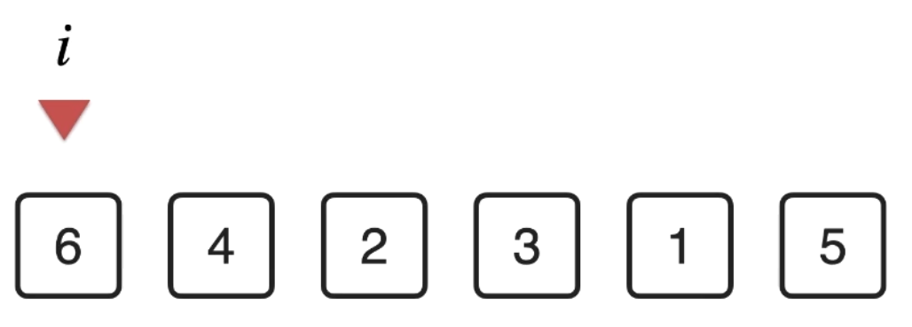

# 排序算法汇总

排序算法是让数据变成有序的算法。

## 排序算法分类

- 基础排序算法
  - 选择排序法
  - 插入排序法
- 复杂排序算法

## 选择排序法

### 简介

选择排序法的思想是：

1. 先把最小的拿出来
2. 剩下的，再把最小的拿出来
3. 剩下的，再把最小的拿出来
4. 重复...

这样，排序过程中会新建一个数组用来存放那些最小的元素，空间复杂度是 `O(n)`，时间复杂度是每次查找最小元素的时间 `n+(n-1)+...+1`,即 `O(n^2)`。

选择排序可以进行原地排序，思想是：将数组分为排好序区间`a[0, i)`和未排序区间`a[i, n)`。从 `a[i, n)`中找到最小的元素`a[x]`，然后与`a[i]`交换位置，那么 `a[0, i+1)` 就是有序区间了，以此循环。

```js
class SelectionSort {
  @logger()
  static sort(arr, compare = defaultCompare) {
    let len = arr.length;
    for (let i = 0; i < len; i++) {
      let minIndex = i;
      for (let j = i + 1; j < len; j++) {
        if (compare(arr[minIndex], arr[j]) > 0) {
          minIndex = j;
        }
      }
      if (i !== minIndex) {
        swap(i, minIndex, arr);
      }
    }
    return arr;
  }
}

console.log(SelectionSort.sort([10, 2, 5, 10], (a, b) => a - b));
console.log(
  SelectionSort.sort(
    [
      { name: "z", score: 100 },
      { name: "b", score: 20 },
      { name: "a", score: 30 },
    ],
    (a, b) => b.score - a.score
  )
);
```

### 作业

1. 实现循环不变量为 `a[0,i)`有序，`a[i, n)`无序的插入排序
2. 实现循环不变量为 `a[0,i)`无序，`a[i, n)`有序的选择排序

## 插入排序法

### 简介

插入排序法的思想是：取未排序区间 `a[i, n)` 的元素 i，在有序区间 `a[0, i)` 从后往前寻找合适位置插入(会与元素一个个比较并交换位置)，以此循环。

小优化：在交换时并不交换位置，而是直接通过赋值，让 3 次操作变为 1 次。具体是先暂存 `a[i]`，然后查找位置，让 `a[j]` 的值变为 `a[j-1]` 的值。

插入排序法的时间复杂度是 `O(n^2)`，不过对于有序数组来说，它的时间复杂度会变为`O(n)`，因为它有提前终止的条件。

```js
class InsetionSort {
  static sort(arr, compare) {
    for (let i = 0; i < arr.length; i++) {
      // 1. 从后往前在 [0, i) 内找合适元素
      let t = arr[i];
      let j;
      // 2. 查找合适位置，并赋值
      for (j = i; j - 1 >= 0 && compare(t, arr[j - 1]) < 0; j--) {
        arr[j] = arr[j - 1];
      }
      arr[j] = t;
    }
    return arr;
  }
}
```



**选择排序和插入排序比较**

- 都是分为 有序区间`a[0, i)` 和无序区间`a[i, n)`。
- 选择排序的 `a[0, i)` 就是 a 的最小元素集合，因为每次选的是最小元素。
- 插入排序每次只移动 `a[i]` 和 `a[0,i)`区间元素交换位置，而不会动 `a[i, n)` 区间的元素

### 作业

1. 实现循环不变量为 `a[0,i)`有序，`a[i, n)`无序的插入排序
2. 实现循环不变量为 `a[0,i)`无序，`a[i, n)`有序的插入排序
