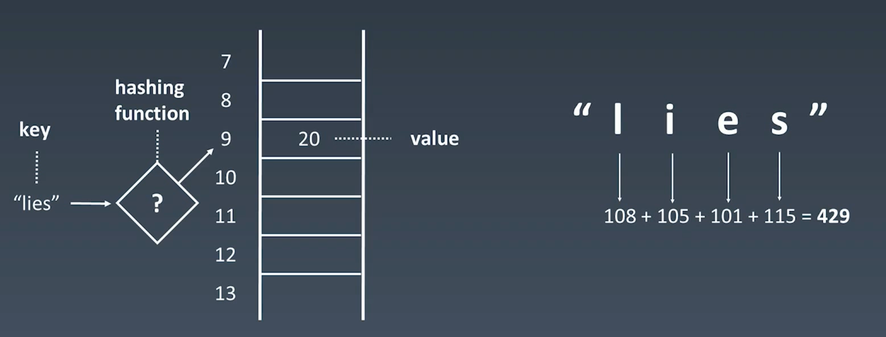
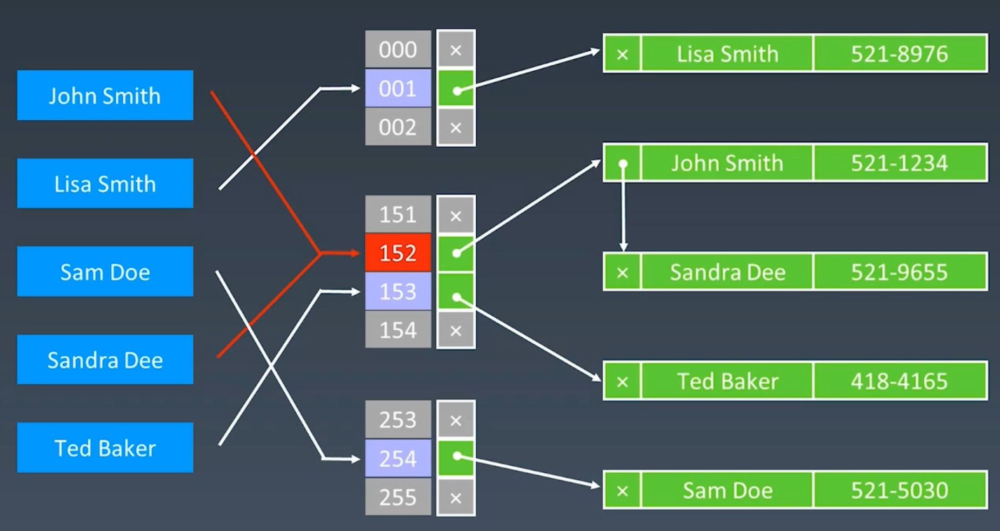

## 哈希表 Hash table

哈希表(Hash table)，也叫散列表，是根据关键码值(key value)而直接进行访问的数据结构。

它通过把关键码值映射到表中一个位置来访问记录，以加快查询的速度。这个映射函数饺子散列函数(Hash Function)，存放记录的数组叫做哈希表（或散列表）。

工程实践

-   电话号码簿
-   用户信息表
-   缓存(LRU Cache)
-   键值对存储(Redis)

哈希函数


哈希冲突(散列冲突、哈希碰撞)
不同的要存储的数据根据哈希函数计算后得到的值一样。会放到相同的桶中。一般会用链表来存储这些数据。
所以要设计好哈希函数

完整结构


java、python 都内置了这种数据结构。
Hashtable


优点和缺点。
O(1)是因为每个桶用数组的序号来存储，通过数组 key 来访问。

工程中一般是用 Map Set

Java code

-   Map key-value 对，key 不重复
    -   new HashMap() / new TreeMap()
    -   map.set(key, value)
    -   map.get(key)
    -   map.has(key)
    -   map.size()
    -   map.clear()
-   Set 不重复元素的集合
    -   new HashSet() / new TreeSet()
    -   set.add(value)
    -   set.delete(value)
    -   set.hash(value)

Python code

```
list_x = [1,2,3,4]
map_x = {
    'jack': 100,
    'zs': 80
}

set_x = {'jack', 'selina', 'Andy'}
set_y = set(['jack', 'selina', 'jack'])
```

-   [Java Set 文档](https://docs.oracle.com/en/java/javase/12/docs/api/java.base/java/util/Set.html)
-   [Java Map 文档](https://docs.oracle.com/en/java/javase/12/docs/api/java.base/java/util/Map.html)

## 题目

### 242.有效的字母异位词

-   [题目](https://leetcode-cn.com/problems/valid-anagram/description/)

```py
class Solution(object):
    def isAnagram(self, s, t):
        """
        :type s: str
        :type t: str
        :rtype: bool
        """
        m = {}
        for i in s:
            if i not in m:
                m[i] = 0
            m[i] += 1
        for j in t:
            if j in m:
                m[j] -= 1
            else:
                m[j] = -1
        for k in m:
            if m[k] != 0:
                return False
        return True

    def isAnagram2(self, s, t):
        s = list(s)
        s.sort()  # .sort() 没有返回值
        t = list(t)
        t.sort()
        return s == t

    def isAnagram3(self, s, t):
        return True if sorted(s) == sorted(t) else False # sorted 有返回值

    def isAnagram3_1(self, s, t):
        return sorted(s) == sorted(t)

    def isAnagram4(self, s, t):
        dic1, dic2 = {}, {}
        for item in s:
            dic1[item] = dic1.get(item, 0) + 1
        for item in t:
            dic2[item] = dic2.get(item, 0) + 1
        return dic1 == dic2

    def isAnagram5(self, s, t):
        dic1, dic2 = [0]*26, [0]*26
        for item in s:
            dic1[ord(item)-ord('a')] += 1
        for item in t:
            dic2[ord(item)-ord('a')] += 1
        return dic1 == dic2
```

### 49. 字母异位词分组

解法：

1. 循环数组，map 存储数据 `{'eat':['eat']}`，然后判断元素是否 isAnagram map 的 key，是则放进 map 的值数组中。
