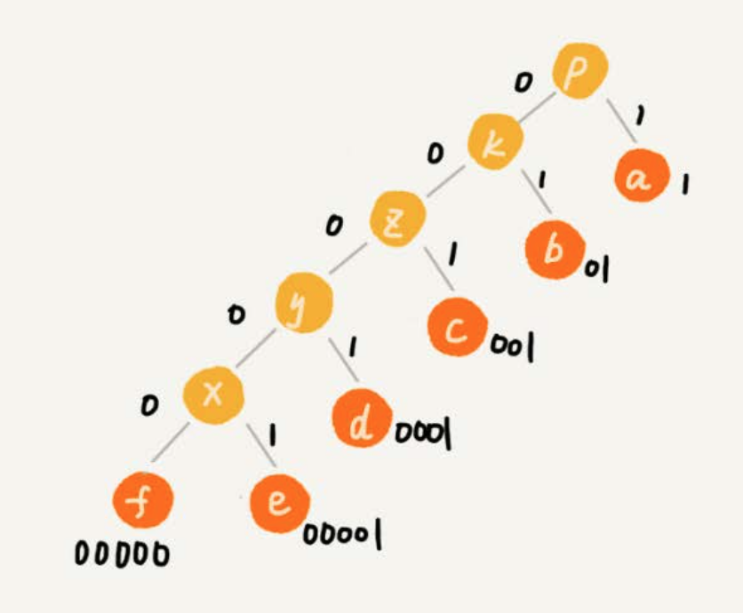

## 概念

贪心算法是一种在每一步都选择当前状态最好或最优的选择，从而希望导致结果是全局最好或最优的算法。

贪心算法与动态规划的不同在于它对每个子问题的解决方案都做出选择，不能回退。动态规划则会保存以前的运算结果，并根据以前的结果对当前进行选择，有回退功能。

贪心法可以解决一些最优化问题，如：求图中最小生成树、求哈夫曼编码（Huffman Coding）、Dijkstra 单源最短路径算法等，然而对于工程和生活中的问题，贪心法一般不能得到我们所要求的答案。

一旦一个问题可以通过贪心法来解决，那么贪心法一般是解决这个问题的最好办法。由于贪心法的高效性以及其所求的的答案比较接近最优结果，贪心法也可以用作辅助算法或者直接解决一些要求结果不特别精确的问题。

## 适用场景

问题能够分解为子问题来解决，子问题的最优解能递推到最终问题的最优解，这种子问题最优解称为最优子结构。

贪心算法的最难的是如何将要解决的问题抽象成贪心算法模型。要证明贪心算法解决问题的正确性是很难的。所以，我们只需要多举几个例子，看一下贪心算法的解决方案是否真的能得到最优解就可以了。

**注意**

-   有时贪心需要一些技巧，从后往前，或从中间某一刻。
-   需要证明贪心能够得到最优解。

## 哈夫曼编码

常用于压缩和解压缩，其压缩率通常在 20%~90%之间。比如一个 1000 字的文件，如果每个字用 1 byte 来存储，则需要 1000 byte 大小。

哈夫曼编码是：

1. 将这些字按照出现频率进行编码（利用贪心算法，频率高的编码长度最短）。
2. 为了能够解压缩，每个编码的开头部分都不能重复，也就是 a -> 1，b 则不能以 1 开头，只能是 01，c 不能以 1、01 开头，只能是 001 。

这样在压缩时就可以减少文件大小。而且能无损的解压缩。

例如，如果此文件只包含`abcde`字符。

```
字符   出现频率  编码
a      500     1
b      300     01
c      100     001
d      80      0001
e      20      0000
```

编码技巧：将每个字符当作一个节点，取出频率最小的两个节点 A、B，然后新建节点 C，把频率设置为这两个节点之和，并当作父节点插入优先队列中，接着重复这个过程，直到队列中没有数据。


接着给每条边一个权值，指向左节点的统统为 0，指向右节点的标记为 1，则从根节点到叶子节点的路径就是对应的字符的哈夫曼编码。



## 题目

### 322. 零钱兑换

https://leetcode-cn.com/problems/coin-change/

### 455.分发饼干

https://leetcode-cn.com/problems/lemonade-change/description/
https://leetcode-cn.com/problems/best-time-to-buy-and-sell-stock-ii/description/
https://leetcode-cn.com/problems/assign-cookies/description/
https://leetcode-cn.com/problems/walking-robot-simulation/description/
https://leetcode-cn.com/problems/jump-game/ 、 https://leetcode-cn.com/problems/jump-game-ii/
