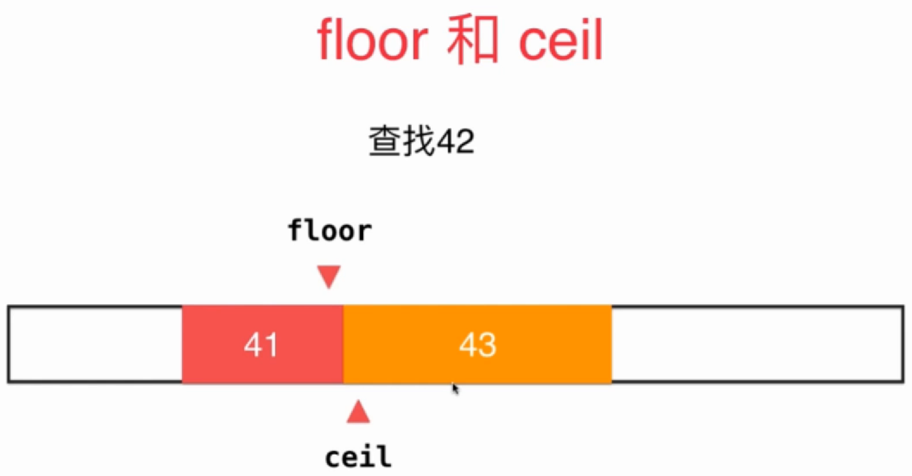
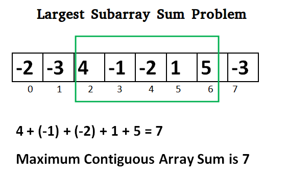

## 链表

- [linked-list](https://github.com/trekhleb/javascript-algorithms/tree/master/src/data-structures/linked-list) 
- [What’s a Linked List, Anyway? [Part 1]](https://medium.com/basecs/whats-a-linked-list-anyway-part-1-d8b7e6508b9d) 
- [What’s a Linked List, Anyway? [Part 2]](https://medium.com/basecs/whats-a-linked-list-anyway-part-2-131d96f71996) 

链表是数据元素的线性集合，每个元素有一个指针指向下一个元素。最简单的链表是每个节点由数据和指向下个元素的索引组成。链表可以插入、删除元素。

链表分为：单向链表、双向链表和循环链表。


**数组和链表的区别**

数组和链表之间的根本区别在于内存分配上。数组是静态数据结构，而链表是动态数据结构。静态数据结构需要在创建结构时分配其所有资源; 这意味着要指定结构的大小，并且如果要添加或删除元素，仍然需要重新指定大小。如果需要将更多元素添加到静态数据结构并且没有足够的内存，则需要复制该数组的数据，并使用更多内存重新创建它，以便可以添加元素它。而动态数据结构可以在内存中方便的增加和删除，因为存放数据不是连续的。

除此之外还有其它几点区别：

- 访问时间：数组访问时间是O(1)，链表是O(n)。
- 因为增加了节点指针，所以空间开销比较大。
- 插入和删除时间：数据插入和删除需要O(n)时间，因为每插入一个，后面的元素都需要往后移动一位。因为不是按顺序存储，所以链表的时间复杂的是O(1)，比如插入只需要将上一个节点的next指向插入元素，插入元素的next指向下一个元素。


下面是链表数据结构：

```
Node 
    - value 值
    - next 指向下一个元素

LinkedList
    - Nodes
    - size() 有多个个节点
    - append() 增加
    - prepend() 
    - find() 搜索
    - delete() 删除
    - deleteHead() 删除头元素
    - deleteTail() 删除尾元素
    - reverse() 反转
    - traverse() 遍历
    - reverseTraversal() 反向遍历
```

### 实现

接下来自己实现一下：

```javascript
/**
 * 链表的节点
 */
class LinkedListNode {
    constructor(value, next = null) {
        this.value = value
        this.next = next
    }
}
/**
 * 链表
 */
class LinkedList {
    constructor() {
        this.head = null
        this.tail = null
    }

    /**
     * @param {*} value 
     * @return {LinkedList}
     */
    append(value) {
        // 新节点
        let newNode = new LinkedListNode(value)

        if (!this.tail) {
            this.head = newNode
            this.tail = newNode
            return this
        }

        this.tail.next = newNode
        this.tail = newNode

        return this
    }

    /**
     * @param {*} value 
     * @return {LInkedListNode}
     */
    prepend(value) {
        let newNode = new LinkedListNode(value, this.head)
        this.head = newNode

        if (!this.head) {
            this.tail = newNode
            return this
        }

        newNode.next = this.head
        return this
    }

    /**
     * 查找元素
     * @param {*} 可以是 value 或 callback
     * @return {LinkedListNode}
     */
    find({ value = undefined, callback = undefined }) {
        if (!this.head) {
            return null
        }

        let currentNode = this.head

        while (currentNode) {
            if (callback && callback(currentNode.value)) {
                return currentNode
            }

            if (value !== undefined && value === currentNode.value) {
                return currentNode
            }

            currentNode = currentNode.next
        }

        return null
    }

    /**
     * 将所有相等的元素删除
     * @param {*} value 
     */
    delete(value) {
        if (!this.head) {
            return null
        }

        let deleteNode = null

        // 如果删除的是头元素，则将头设置为和value不等的元素
        while (this.head && this.head.value === value) {
            deleteNode = this.head
            this.head = this.head.next
        }

        let currentNode = this.head

        // 这里没有比较尾元素，因为它的 next 为 null，自己画图分析
        if (currentNode) {
            while (currentNode.next) {
                if (value === currentNode.next.value) {
                    deleteNode = currentNode.next
                    currentNode.next = currentNode.next.next
                } else {
                    currentNode = currentNode.next
                }
            }
        }

        // 比较尾元素
        if (value === this.tail.value) {
            this.tail = currentNode
        }

        return deleteNode
    }

    deleteHead() {
        if (!this.head) {
            return null
        }

        let deleteNode = this.head

        if (this.head.next) {
            this.head = this.head.next
        } else {
            // 如果只有一个元素
            this.head = null
            this.tail = null
        }

        return deleteNode
    }

    deleteTail() {
        // 0 或 1 个元素
        let deleteTail = this.tail
        if (this.head === this.tail) {
            this.head = null
            this.tail = null
            return deleteTail
        }

        let currentNode = this.head
        while (currentNode.next) {
            if (!currentNode.next.next) {
                currentNode.next = null
            } else {
                currentNode = currentNode.next
            }
        }
        this.tail = currentNode
        return deleteTail
    }

    /**
     * 将链表转成数组
     */
    toArray() {
        const nodes = []

        let currentNode = this.head
        while (currentNode) {
            nodes.push(currentNode)
            currentNode = currentNode.next
        }

        return nodes
    }

    size() {
        return this.toArray.length
    }

    /**
     * 
     * @param {将数组转成链表} nodes 
     */
    fromArray(nodes) {
        nodes.forEach(node => this.append(node))

        return this
    }

    toString(callback) {
        return this.toArray().map(node => node.toString(callback).toString)
    }

    /**
     * 反转链表 */
    reverse() {
        let currentNode = this.head
        let prevNode = null
        let nextNode = null

        while (currentNode) {
            nextNode = currentNode.next
            currentNode.next = prevNode

            prevNode = currentNode
            currentNode = nextNode
        }

        this.tail = this.head
        this.head = prevNode

        return this
    }
}
```

1. 线性数据结构和非线性数据结构的区别？
2. 数组和链表的区别？
3. 链表的种类有哪些？


## 二分查找法

对于有序数列，才能使用二分查找法`O(logn)`。

```js
const binarySearch = (arr, searchVal) => {
    // [l, r]
    let l = 0, r = arr.length - 1
    while (l <= r) {
        // 不要用 l+r/2，防止数据大了溢出
        let mid = Math.floor(l + (r - l) / 2)
        if (arr[mid] == searchVal)
            return mid

        if (arr[mid] > searchVal) {
            r = mid - 1
        } else {
            l = mid + 1
        }
    }

    return -1
}

let arr = [2, 4, 6, 8, 9, 10, 30, 33]  // 注意是有序数组

let index = binarySearch(arr, 9)

console.log(index)
```

二分搜索树还需要考虑有相等值的情况，这个时候找到的数据不一定是第一个。而且如果没有数据，需要提供`floor`，`ceil`方法。



### 二分搜索树

通常是查找表的实现，字典数据结构。

| | 查找元素 | 插入元素| 删除元素 |
| ---- |----|----| ----|
| 普通数组 |O(n)|O(n)|O(n) |
| 顺序数组 |O(logn)|O(n)|O(n) |
| 二分搜索树|O(logn)|O(logn)|O(logn) |

优势:
- 高效:不仅可以查找，而且可以高效插入，删除数据，动态维护数据。
- 方便回答很多数据之间的关系问题：min,max,floor,ceil,rank,select。

二叉树：
- `left.key <= x.key <=right.key`。
- `nil`表示没有子节点或没有父节点的节点。
- 不一定是完全二叉树。

## 跳表

学习完需要掌握：

1. 什么是跳表，它的思想以及它是如何查找元素的?
2. 跳表的时间、空间复杂度分析?
3. 跳表的代码实现？它是如何维持平衡的?
4. 为什么Redis要用跳表来实现有序集合，而不是红黑树?

### 什么是跳表？

如果数据存在数组中，可以用二分查找法查找数据，它是O(logn)的时间复杂度。但是如果数据存在链表中，查找起来就是O(n)，这时可以使用跳表来将时间复杂度降低到O(logn)。

比如每隔一个元素，增加一层索引。

```
- 索引3   1               9 
         |
- 索引2   1   -   5       9 
                 |
- 索引1   1   3   5 - 7   9 
                      |
- 原始链表 1 2 3 4 5 6 7-8-9 10 
```

这样比如在查找 8 时，一层层索引查找其归属。如先查第三层索引 8 属于1-9，再查第二层，8属于5-9，第一层 8 属于7-9，最后遍历原始链表中的7-8-9，从而找到 8。这样时间复杂度会大幅度降低。

### 时间复杂度分析

如果链表有 n 个元素。每 2 个元素建立一层索引。

- 遍历多少层：那么设建立 h 层索引，n/2^h = 2(最上层为2个节点)。即 h = logn。
- 每一层遍历多少个节点：只需遍历3个节点。因为如果到k-1级索引，如7-9，只需遍历k级的7-8-9即可。

所以时间复杂度是 3 * logn = O(logn)。

### 空间复杂度分析

原始链表为n，每2个元素抽一层，每层需要 n/2 + n/4 + n/8 + ... + 2，所以跳表的时间复杂度为 O(n)。如果每 3 个元素抽一层，索引节点大约是 n/2，空间复杂度虽然还是 O(n)，但是降低了一半。另外一般链表节点都是存的对象，而索引节点只需要存一个关键值或指针，所以可以忽略。

所以跳表是一种空间换时间的设计思想。通过建立多级索引来提高查询速度。

### 动态插入和删除

跳表插入和删除的时间复杂度都是O(logn)。

在单链表中，插入一个元素时间复杂度是O(1)，但是插入前查找的时间复杂度是O(n)。

跳表查找节点的时间复杂度是 O(logn)，所以查找插入位置的时间也是 O(logn)。删除节点时，如果节点在索引中也有，则还要删除索引中的节点，只需要将前驱节点指向删除节点的下一个指针即可。


### 跳表索引动态更新

不断的插入，删除可能会导致 2 个节点之间存在很多节点，跳表就退化成了单链表。所以需要维护索引和原始链表之间的平衡。

跳表是通过随机函数来维护平衡性的。当插入数据时，通过随机函数得到 K 值，然后将节点添加到第一级到第K级索引中。

> 为什么Redis要用跳表来实现有序集合，而不是红黑树?

Redis 的核心操作：

- 插入一个数据
- 删除一个数据
- 查找一个数据
- 按照区间查找数据
- 迭代输出有序序列

这几个操作和红黑树都可以完成。但是按照区间来查找，红黑树效率没有跳表高。跳表可以做到 O(logn) 跳到区间起始点，然后在原始链表上往后遍历就可以了。

另外，跳表更容易实现，可读性好，更灵活。可以通过改变索引构建策略平衡执行效率和内存消耗。

不过红黑树比跳表出现的早，很多语言的 Map 类型都是红黑树来完成的，做业务时直接用即可，而跳表需要自己实现。

## 哈希表


> 本文是学习极客时间[<<数据结构与算法之美>>](https://time.geekbang.org/column/intro/126)的笔记。

### 简介

散列表(hash table)也叫做哈希表，它是将使用哈希函数将元素生成一个数组序号(hash值，是一个正整数)，然后存放到数组的每一项中(也叫桶)。

比如一些单词，可以根据单词的长度生成序号，然后存在数组中。在查找的时候，计算单词的hash值，取`arr[hash值]`即可。因为要存在数组中，所以 hash 值要是非负整数。

最好的情况下，每个单词长度不一样，在查找元素的时候只需要 O(1) 时间即可。但是这种情况在实际中是不存在的，因为有相同长度的单词。所以这些单词的 hash 值是相同的，它们会放到数组同一项中。这种情况叫做散列冲突(也叫哈希碰撞)。

即使md5、sha、crc等哈希算法也不能避免散列冲突，而且数组存储空间有限。解决散列冲突的常用方式: 

1. 开放寻址法
2. 链表法: 数组中每一项用链表来存储，这样相同 hash 值的元素就可以存放在链表中。

## 开放寻址法

开放寻址法(linear probing)是循环的探测数组中的空位。比如有个元素要插入数组中，如果该 hash 值处已经有元素了，则看下一个位置有没有元素，没有则放入。删除时不能只将元素设置为空，因为这样会让原来的查找算法失效(找错元素了)，而是要将它标记为 deleted。查找时遇到 deleted 不要停下来。

这种方法插入的数据越多，散列冲突可能性越大，空闲位置越少，查找时间会越来越长，最坏时间复杂度是 O(n)。通用删除和查找也是 O(n)。

**二次探测（quadratic probing）**: 探测步长从 1 变成原来的二次方，即原来是 hash(key) + 0，hash(key) + 1, hash(key) + 2...进行探测。现在变成hash(key) + 0，hash(key) + 1, hash(key) + 4...。

**双重散列（double hashing)**: 即有多个 hash 函数，如果第一个函数结果有碰撞，则用第二个函数。

装载因子(load factor)越大，说明空闲位置越少，冲突越多，散列表性能会下降。

```
装载因子 = 表元素的个数 / 散列表长度
```

个人感觉开放寻址法太麻烦了，记住思想即可，一般还是用下面的链表法。

## 链表法

数组中每一项用链表来存储，这样相同 hash 值的元素就可以存放在链表中。查找的时间复杂度由链表查找时间复杂度决定。为`O(n/m)`，其中 m 为桶的个数。

## 面试题

> word文档单词拼写功能如何实现？

> 假设有10万 url 访问日志，如何按照访问次数排序？

> 有两个字符串数组，每个数组大约10万条字符串，如何快速查找两个数组中相同的字符串？


**如何将二维数组展平?**

```
[1,2,3] + ''
// 1,2,3

[1,2,3, [4,5]] + ''
// 1,2,3,4,5

// 方法1，不推荐,可以递归解构
eval(`[${[1,2,3,[4,5]] + ''}]`)
// [1,2,3,4,5]

// 方法2
arr.reduce((a,b)=>{
  return a.concat(b)
}, [])

// 方法3
[].concat(...[1,2,3, [4,5]])

// 方法4
newArr = []
arr.forEach(item=>{
  item.forEach(v=>newArr.push(v))
})
```


1.1.3 网络编程相关基础


问题1: 网络IO模型有哪些?
5种网络I/O模型，阻塞、非阻塞、I/O多路复用、信号驱动IO、异步I/O。从数据从I/O设备到内核态，内核态到进程用户态分别描述这5种的区别。


问题2: I/O多路复用中select/poll/epoll的区别？
从select的机制，以及select的三个缺点，讲解epoll机制，以及epoll是如何解决select的三个缺点的。还会讲到epoll中水平触发和边沿触发的区别。


1.1.4 HTTP相关基础


问题1: 客户端访问url到服务器，整个过程会经历哪些？
从七层网络模型，HTTP->TCP->IP->链路整个过程讲解报文的产生以及传递的过程


问题2: 描述HTTPS和HTTP的区别
从端口的区别，以及HTTPS是在SSL的基础上以及加密等方面说明


问题3: HTTP协议的请求报文和响应报文格式
要非常清楚请求报文和响应报文的组成部分，要求在写具体案例。


问题4: HTTP的状态码有哪些?
从2xx,3xx,4xx,5xx分别举例出常见的code，面试官会问301和302的区别，以及500/503/504分别在哪些场景出现。


## 哈希算法

哈希算法就是将任意长度的二进制值串映射为固定长度的二进制值串。映射为的二进制值串叫做哈希值。

哈希算法的特点：

- 单向性：从哈希值不能反向推导出原始数据(所以哈希算法也叫单向哈希算法); 
- 雪崩效应：对输入数据非常敏感，哪怕原始数据只修改了一个Bit，最后得到的哈希值也大不相同; 
- 冲突小：散列冲突的概率要很小，对于不同的原始数据，哈希值相同的概率非常小; 
- 效率高：哈希算法的执行效率要尽量高效，针对较长的文本，也能快速地计算出哈希值。

MD5 的哈希值是 128 位的 Bit 长度，为了方便通常转为 16 进制。

最常见的七个，分别是安全加密、唯一标识、数据校验、散列函数、负载均衡、数据分片、分布式存储。

### 安全加密

最常用于加密的哈希算法是MD5(MD5 Message-Digest Algorithm，MD5消息摘要算法)和SHA(Secure Hash Algorithm，安全散列算法)。权衡安全性和计算时间。

鸽巢原理(也叫抽屉原理)。这个原理本身很简单，它是说，如果有10个鸽巢，有11只鸽子，那肯定有1个鸽巢 中的鸽子数量多于1个，换句话说就是，肯定有2只鸽子在1个鸽巢内。

> 为什么哈希算法无法做到零冲突?

哈希算法产生的哈希值的长度是固定且有限的。比如前面举的MD5的例子，哈希值是固定的128位二进制串，能表示的数据是有限的，最多能表 示2^128个数据，而我们要哈希的数据是无穷的。基于鸽巢原理，如果我们对2^128+1个数据求哈希值，就必然会存在哈希值相同的情况。这里你应该能想 到，一般情况下，哈希值越长的哈希算法，散列冲突的概率越低。

### 唯一标识

> 如何快速判断图片是否在图库中?

图片大了转化也耗时，所以取图片`头中尾`的 100 个字节生成 hash 值做对比，如果一样则再根据图片的路径，做全量hash对比。

### 数据校验

我们知道，BT下载的原理是基于P2P协议的。我们从多个机器上并行下载一个2GB的电影，这个电影文件可能会被分割成很多文件块(比如可以分成100块，每块大约20MB)。等所有的文件块都下载完成之后，再组装成一个完整的电影文件就行了。我们知道，网络传输是不安全的，下载的文件块有可能是被宿主机器恶意修改过的，又或者下载过程中出现了错误，所以下载的文件块可能不是完整的。如果我们没有能力检测这种恶意修改或者文件下载出错，就会导致最终合并后的电影无法观看，甚至导致电脑中毒。现在的问题是，如何来校验文件块的安全、正确、完整呢?其中一种思路：

我们通过哈希算法，对100个文件块分别取哈希值，并且保存在种子文件中。我们在前面讲过，哈希算法有一个特点，对数据很敏感。只要文件块的内容有一 丁点儿的改变，最后计算出的哈希值就会完全不同。所以，当文件块下载完成之后，我们可以通过相同的哈希算法，对下载好的文件块逐一求哈希值，然后 跟种子文件中保存的哈希值比对。如果不同，说明这个文件块不完整或者被篡改了，需要再重新从其他宿主机器上下载这个文件块。

### 哈希函数

哈希函数也是哈希算法的一种应用。用于生成减小散列冲突的值。

> 区块链使用的是哪种哈希算法吗?是为了解决什么问题而使用的呢?

- [区块链入门教程](http://www.ruanyifeng.com/blog/2017/12/blockchain-tutorial.html)

### 负载均衡

> 如何才能实现一个会话粘滞(session sticky)的负载均衡算法?

会话粘滞就是一个会话的所有请求都分配到同一个服务器上。最直接的方法：生成`用户 - 会话id - 机器id`的映射关系，每次请求过来都查找一遍机器id，然后分配。但是缺点是如果用户很多会导致映射表很大，浪费内存空间。另外客户端下线、上线，服务器扩容、缩容都会导致映射表失效，维护映射表的成本很大。所以可以通过对客户端 ip 或会话 id 计算 hash 值，然后将 hash 值与服务器列表的大小进行取模，得到服务器编号。

### 数据分片

> 假设有 1 T的日志文件，如何统计搜索关键词出现的次数。

难点：内存大、处理时间长。

所以将数据分片，然后交给多台机器处理。从日志中依次读取搜索关键词，通过哈希函数计算哈希，再根据机器数 n 取摸后，就是分配的机器号。

实际上，这里的处理过程也是MapReduce的基本设计思想。

> 如果有 1 亿张图片构建散列表需要多少台机器？

散列表每个数据单元需要一个 hash 值和图片文件的路径，如果通过 md5 得到 hash 值，长度为 128 bit，即 16 个字节，文件路径长度上限是 256 字节，假设平均 128 个字节，如果是用链表来解决冲突，需要一个指针 8 字节。所以散列表中每个数据单元占 152 字节(估算)。

假设一台机器内存为 2 GB，散列表装载因子为 0.75，一台机器可以给 1000w (2GB*0.75/152)张图片构建散列表。所以需要 10 几台机器。

操作系统限制： Linux的路径长度限制为4096字节（估计这里指的char字符，不是unicode字符。该点需要验证），文件名长路限制为255字节。windows 是 256 字节（应该是Unicode字符，即中文占一个字节）。

### 分布式存储

可以通过哈希算法对数据取哈希值，然后对机器个数取模，得到数据存储的机器编号。但是数据增多，机器扩容就麻烦了，会出现数据散乱的问题。所以需要对所有数据进行重新计算哈希值，重新搬移到正确的机器上，这样会导致缓存全部失效，请求都去请求数据库，可能会压垮数据库。缩容会导致某些请求无法处理。

一致性哈希算法：假设我们有k个机器，数据的哈希值的范围是[0, MAX]。我们将整个范围划分成m个小区间(m远大于k)，每个机器负责m/k个小区间。当有新机器加入的时候， 我们就将某几个小区间的数据，从原来的机器中搬移到新的机器中。这样，既不用全部重新哈希、搬移数据，也保持了各个机器上数据数量的均衡。

- [五分钟看懂一致性哈希算法](https://juejin.im/post/5ae1476ef265da0b8d419ef2)
- http://www.zsythink.net/archives/1182/

## 二叉树


根节点、叶子节点、父节点 、子节点、兄弟节点 、节点的高度、深度(从0开始)、层数、树的高度(根节点的高度)。


每个节点最多只有 2 个子节点的树，这 2 个节点分别叫左子节点、右子节点。

完全二叉树：其它层节点个数达到最大，最后一排叶子节点都靠左排列。
满二叉树: 除了叶子节点，每个节点都有左右子节点。是一种特殊的完全二叉树。


二叉树可以使用链式存储和数组顺序存储。完全二叉树用数组存储最省空间。


- 前序遍历: 中 - 左 - 右
- 中序遍历: 左 - 中 - 右
- 后序遍历: 左 - 右 - 中
- 按层遍历:广度优先的遍历算法。

时间复杂度，3 种遍历方式中，每个节点最多会被访问 2 次，所以时间复杂度是 O(n)。

实现


> 1. 给定一组数据，比如1，3，5，6，9，10。你来算算，可以构建出多少种不同的二叉树?

这是一个卡特兰数，有`C[2n,n]/(n+1)`种形状，节点的不同又是一个全排列，所以一共就是`n!*C[2n,n]/(n+1)`个二叉树，即 132 * 6! = 。通过数学归纳法推导。

卡特兰数前几项为：1, 2, 5, 14, 42, 132, 429, 1430, 4862, 16796, 58786。

- [Catalan number卡塔兰数的应用](https://www.jianshu.com/p/26925a2fc5e7)


二叉查找树的要求：在树中任意一个节点，其左子树的每个节点的值都小于这个节点的值，其右子树的每个节点的值都大于这个节点的值。

**查找**

**插入**


## 最大子列和


最大子列和就是查找一个数组中连续数字相加最大和是多少的问题。



上面这张图中，第2项到第6项的和是7，最大。

它的算法是：从左向右遍历，如果当前和小于0，则舍弃(因为负数再怎么加也是让和变小)，从下个元素再开始；如果当前和大于之前的和，则保留。代码如下：

```javascript
let arr = [-1, -4, -2, 5, 10, -1]

function maxSubSum(arr) {
    let thisSum = maxSum = arr[0]
    let start = 0
    let end = 0

    for (let i = 0; i < arr.length; i++) {
        thisSum += arr[i]

        if (thisSum >= maxSum) {
            maxSum = thisSum
            end = 1
        } else if (arr[i] > maxSum) {  
            thisSum = maxSum = arr[i]
            start = i
            end = i
        }
    }
    return { maxSum, start, end }
}

console.log(maxSubSum(arr))   // { maxSum: 15, start: 3, end: 4 }
```

## 排列组合问题


今天一同事要开金额100的发票，有很多小订单，金额如`29.54`、`20`等，需要刚好把某几个小订单的金额组成100。

刚开始想着把所有可能性列出来，比如将`C(100,2)`、`C(100,3)`...都生成一个二维数组，如`[[0,0],[0,1]...]`这样做，但是搞了半天没有搞出来。于是网上找了下方法，看完后发现原来这么简单，于是自己手写了一遍。

```javascript
function combine(arr, index = 0, totalArr = [], totalIndexArr = []) {
    let newEl = arr[index]
    totalArr.push(newEl)
    totalIndexArr.push(index)

    let len = totalArr.length
    index += 1
    for (let i = 0; i < len; i++) {
        totalArr.push(totalArr[i] + arr[index])
        totalIndexArr.push(totalIndexArr[i] + ',' + index)
    }

    if (index >= arr.length - 1) return {totalArr, totalIndexArr}
    else return combine(arr, index, totalArr, totalIndexArr)
}

// var data = ['a', 'b', 'c', 'd'];
var data = [5, 10, 5, 4, 6]

let {totalArr, totalIndexArr} = combine(data)

totalArr.forEach((item, i) => {
    if (item === 15) {
        console.log(totalIndexArr[i])
    }
})
// 打印结果
// 0,1
// 1,2
// 0,3,4
// 2,3,4
```

思路就是用个新数组存储组合的结果，取出新元素和新数组每一项加起来就可以了。

## 资料


- [常见数据结构与算法javascript实现](http://blog.csdn.net/haoshidai/article/details/52263191)
- [scargtt的博客](http://blog.csdn.net/scargtt)
- [数据结构和算法](http://study.163.com/course/introduction.htm?courseId=468002#/courseDetail?tab=1)
- [深度剖析：如何实现一个 Virtual DOM 算法](https://www.w3cplus.com/javascript/Virtual-DOM-diff.html)
- [JavaScript和树（一）](http://ife.baidu.com/course/detail/id/108)
- [JavaScript和树（二）](http://ife.baidu.com/course/detail/id/110)
- [JavaScript和树（三）](http://ife.baidu.com/course/detail/id/111)
 实现树形组件  http://ife.baidu.com/course/detail/id/84


