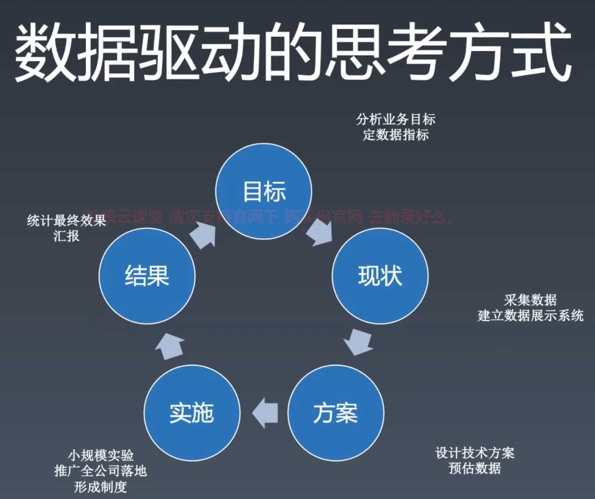
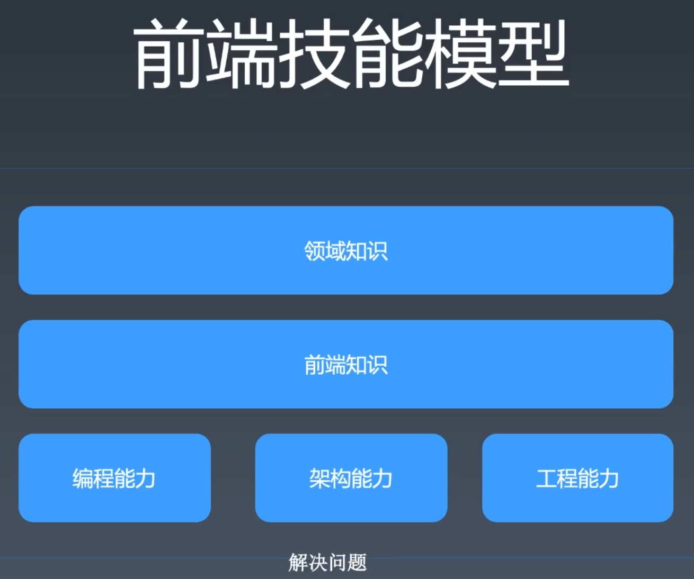

# 前端工程体系

## 什么是优秀前端工程师

- 领域知识，而且要形成体系
- 3 大能力
  - 编程能力：能不能做出来
  - 架构能力： 项目规模做多大
  - 工程能力：多少人一起做
- 潜力
  - 前面某一段是否没走好，导致后面潜力不够
- 职业规划
  - 工程师
  - 资深工程师
  - 专家
  - 经理
- 成就，像精通(这些都是虚的，无法量化)，作出的东西取得多大效果是关键

```
- 晋升 - 成长 - 成就
|               |
-----------------
```

晋升后，进入好的环境，成长，有成就后又晋升

成就：

- 业务型成就
  - 业务目标
    - 理解公司业务的核心目标
    - 目标转化为指标
  - 技术方案
    - 业务指标到技术指标的转化
    - 形成纸面方案，完成小规模试验
  - 实施方案
    - 确定实施目标、参与人
    - 管理实施进度
  - 结果评估
    - 数据采集、数据报表
    - 向上级汇报

案例

```
业务目标&指标：点击率
技术方案：给 tab 组件增加手势操作
实施：在业务中加入对应功能，并上线
结果：点击率增加 3 倍
实施 2:编写通用 tab 组件，向所有导购业务推广，形成制度
结果: 推广到所有导购业务，符合预期

成就是属于团队的，领导认可
```

技术难题

目标：公认的技术难点
实施方案：依靠扎实的编程能力、架构能力形成解决方案。
结果: 问题解决

案例- 爬取商品价格

在某浏览器插件项目中，需要爬各个网站价格比价，但是网站价格是图片的
方案：引入 js 端数字识别技术，靠 AI 技术解决
实施：成功上线
结果：成功采集到信息

工程型成就：
目标：质量、效率
方案与实施：规章制度、库、工具、系统
结果：线上监控

案例：xss 攻击的预防
目标&指标：xss 攻击白帽子反馈漏洞
技术方案：整理安全手册，review 历史代码，代码扫描工具
实施：对全体前端宣讲，整体 review 代码，更改代码发布流程
结果:Xss 漏洞大幅减少



前后数据对比，与业务挂钩。如淘宝的：转化率、成单量等。页面加载时长与点击率、转化等挂钩。
目标要与业务、赚钱挂钩。



工程能力

工具链

- 工具链的作用
- 工具的分类
  - 脚手架 init
  - 本地调试 run
  - 单元测试 test
  - 发布 publish
- 工具链体系的设计
  - 版本问题
  - 数据统计 比如发布了多少次，run 了多少次，安装了多少依赖

持续集成

- 客户端软件持续集成
  - Daily build 集成时间太长，要每天构建
  - BVT
- 前端持续集成
  - Check-in build 检查是否符合，比如图片大小是否符合
  - Lint + Rule Check

技术架构
客户端架构：解决软件需求规模带来的复杂性
服务端架构：解决大量用户访问带来的复杂性
前端架构？解决大量页面需求带来的重复劳动问题(复用)

复用 3 个方面

- 库: 有复用价值的代码
  - url (文档在 ietf 组织)
  - ajax
  - env
- 组件：UI 上多次出现的元素 (组件的定义和基础设施，就是组件化方案)
  - 轮播
  - tab
- 模块：经常被使用的业务区块
  - 登录
