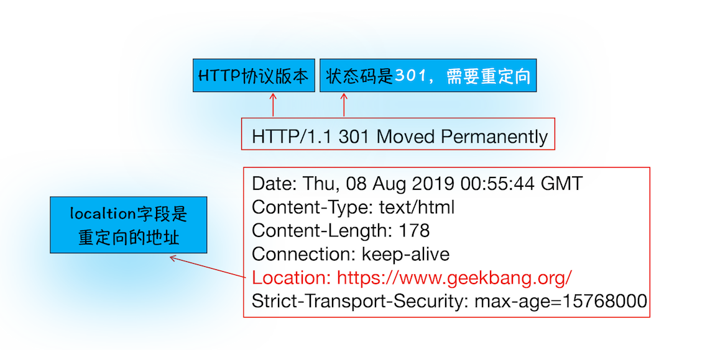

# 概述

## chrome 架构

多进程架构

> 为什么打开一个页面，有 4 个进程？

### 进程和线程

线程是用来执行任务的，它不能独立存在，必须由进程来启动和管理。
进程是程序的运行实例，程序启动时，操作系统给程序分配的一块内存，用来存放代码、运行中的数据和一个执行任务的主线程。这样一个运行环境叫做进程。
进程使用多线程来提高运算效率。

特点：

-   进程中一个线程出错，会导致整个进程崩溃。
-   线程之间共享进程的数据。
-   当一个进程关闭后，操作系统会回收进程所占用的内存。
-   进程之间是相互隔离的，一个挂了不影响另一个。之间数据通信需要使用 IPC 的机制。

### 单进程

-   不稳定，一个线程出错，就导致进程崩溃。
-   不流畅，如果只有一个线程，死循环时，其它的任务都要等待。
-   不安全，插件或页面代码能使用主进程数据，对系统进行操作,，直接控制电脑。因为主进程不可能隔离，这样浏览器就不能读写系统了。另外，其它页面的内容，如果是在写邮件，也没了。

### 多进程

-   解决不稳定，因为进程是隔离的，互不影响
-   解决不流畅，即使 js 阻塞，也不影响浏览器和其它页面，死循环只影响当前 tab
-   解决不安全，使用安全沙箱，给渲染进程和插件进程上锁。无法获取系统权限。

### 架构

-   渲染进程: 负责 html css js 转成网页，排版引擎 blink 和 js 引擎 v8 都在这，默认情况下，每个 tab 会创建一个渲染进程。同一个站点如,x.y.com z.y.com 新页面会复用同一个进程，因为有时需要共享 js 执行环境。iframe 也会新开进程。
-   插件进程
-   网络进程
-   浏览器主进程： 负责界面显示，用户交互，子进程管理，存储
-   GPU 进程：初衷是实现 css 3d，后来用来绘制 UI 界面
-   v8 代理解析工具 chrome 支持 js 写连接代理的脚本，叫在线 pac 代理脚本，这个进程叫 Utility: V8 Proxy Resolver。
-   Audio 服务进程，对所有页面提供基础服务。

缺点：

-   更高的资源占用
-   更复杂的体系架构：耦合高、扩展性差

未来的架构

-   面向服务的架构，将原来的模块重构成服务，每个服务定义好接口，通过 IPc 来通信，从而内聚，松耦合，易于维护和扩展


-   此外，chrome 还提供了灵活的弹性架构，在资源受限制的设备上，会将很多服务整合到一个进程，节省内存


## TCP 协议

衡量 web 性能有个重要的指标 FP(first paint)，是从页面加载到首次开始绘制的时长，这个指标直接影响了用户的跳出率。更快的页面响应意味着更多的 pv，更高的参与度，以及更高的转换率。

影响 FP 的一个重要因素是网络加载速度。

1. ip 把数据包送达目的主机

传输前，数据包会带上自身的 ip 地址(为了可以让目标主机回复)、目标主机的 ip 地址信息(为了可以送达)。

ip 头包含 ip 版本、源 ip 地址、目标 ip 地址、生存时间等信息。

2. UDP 把数据包送达应用程序

ip 层并不知道数据要交给哪个应用程序，所以需要用户数据包协议 UDP(user datagram protocol)。

UDP 中有端口号，通过端口号将数据包发送给指定程序。发送数据时，端口号也会被放入到 UDP 头中，到达目标主机时，也会拆开 UDP 头。

UDP 的特点

-   能校验数据
-   不能保证数据可靠性(只管发，不确认)，传输速度快
-   不能将乱序小包组成完整文件

3. TCP

transmission contrl protocol 传输控制协议，是一种面向连接的、可靠的、基于字节流的传输层通信协议。

-   对于数据包丢失的情况，会重传
-   引入了数据包排序机制(有序号)，可以把乱序的数据包组合成完整的文件

一个 tcp 完整的连接:

-   建立连接阶段，三次握手。
-   传输数据阶段，接收端需要对每个数据包进行确认操作，在规定时间内没有收到接收端的反馈，就判断为数据包丢失，会触发重发机制。大文件传输时会拆成小包，在接收端按照 tcp 头里的序号进行排序，组成完整的包。
-   断开连接阶段，四次挥手。

所以 tcp 为了保证数据传输的可靠性，牺牲了数据包的传输速度，三次握手和数据包校验机制等在传输过程中将数据包的数量提升了一倍。

网络进程知道每个 tcp 链接所对应的标签是那个，所以接收到数据后，会把数据分发给对应的渲染进程。

一个包从主机 A 到主机 B 的旅程：

-   应用层加上 http 头，发给 tcp 层。
-   tcp 层加上 tcp 头，包含端口号。
-   数据包交给网络层，网络层加上 ip 头，组成新的 ip 数据包交给底层。
-   底层通过物理网络将数据包发送给 B。
-   数据包传输到 B 的网络层，拆开数据包的 ip 头信息，并将拆开的数据部分交给 tcp 层。
-   tcp 进行拆包取出端口号，交给浏览器。
-   浏览器的网络进程知道 tcp 连接对应的标签。所以收到数据后，会分发给对应的渲染进程。

tcp 交给 http 时丢包？应该会重新再发给 http，tcp 已经收到包了，本地给 http 很快。

## http 过程

请求

1. 构建请求

```
GET /index.html HTTP1.1
```

2. 查找缓存

发起请求之前，会查找缓存。如果有，则直接返回并结束，而不会发起请求。好处是：缓解服务器压力，提升性能。如果没有缓存，则发请求

3. 为 tcp 连接准备 ip 和端口

http 工作前，浏览器会通过 tcp 与服务器建立连接，也就是 http 的内容是通过 tcp 传输数据阶段来实现的。

但是现在只有一个域名，所以需要 DNS(域名系统) 解析，将域名映射为 ip。

浏览器还有 DNS 数据缓存服务，如果没有过期会直接使用，这样会减少一次网络请求。

拿到 ip 后，开始获取端口号，如果没有指明，http 协议默认是 80 端口。

4. 等待 tcp 队列

chrome 有个机制，同一个域名最多只有 6 个 tcp 连接，超出的会进入排队等待。如果数量小于 6，会直接进行下一步，建立 tcp 连接。

5. 建立 tcp 连接

6. 发起 http 请求

浏览器会发送请求行：请求方法、请求 uri(uniform resource identifier) 和 http 版本号。


7. 服务器处理 http 请求。


并不是所有请求都会被服务器处理，服务器通过状态码告诉浏览器它的处理结果。如 200、400。

8. 断开连接

一旦服务器向客户端返回了结果，它就要关闭 tcp 连接，不过如果有头信息:

```
Connection: Keep-Alive
```

那么 tcp 连接会在发送完后保持打开，保持 tcp 连接可以省去下次建立连接的时间，提升资源加载速度。

9. 重定向



浏览器收到 301，会根据响应头的 Location 字段重新导航。

返回 301 不返回 location 会怎么样？

为什么很多站点第二次打开速度会很快？

主要是第一次缓存了数据。哪些数据会缓存？DNS 缓存和页面资源缓存。


服务器响应头返回 Cache-Control 字段设置资源是否缓存。

```
Cache-Control: Max-age=2000
```

缓存过期，会发送网络请求，请求头会带上:

```
If-None-Match:"4f80f-13c-3a1xb"
```

服务器收到后，会根据 If-None-Match 判断请求资源是否有更新。

-   如果没有更新，则返回 304，告诉浏览器这个缓存可以继续用，这次就不发送重复数据给你了。
-   如果资源有更新，服务器就直接返回最新资源。

登录状态是如何保持的？

服务器返回 Set-Cookie，客户端每次发送 Cookie 字段。


如果一个网络请求时间过久，怎么分析是哪个地方出了问题？

1. 首先猜测最可能的出问题的地方，网络传输丢包比较严重，需要不断重传。然后通过 ping curl 看看对应的时延高不高。
2. 然后通过 wireshake 看看具体哪里出了问题。
3. 假如别人访问很快，自己电脑很慢，就要看看自己客户端是否有问题了。

## 导航流程

> 从输入 URL 到页面展示，这中间发生了什么？


整个过程需要各个进程之间的配合。

-   浏览器进程主要负责用户交互、子进程管理和文件存储等功能。
-   网络进程是面向浏览器和渲染进程等提供网络下载功能。
-   渲染进程主要是把网络进程下载的 html、js、css、图片等解析为可以显示和交互的页面，因为渲染进程所有内容都是通过网络获取的，会存在一些恶意代码利用浏览器漏洞对系统进行攻击，所以运行在渲染进程的代码是不被信任的，渲染进程在安全沙箱里运行。

整个过程大致如下：

-   用户在浏览器进程里输入请求信息。
-   网络进程发起 URL 请求。
-   服务器响应 URL 请求之后，浏览器进程开始准备渲染进程。
-   渲染进程准备好之后，需要先向渲染进程提交页面数据，称为提交文档阶段。
-   渲染进程接受完文档信息之后，便开始解析页面和加载子资源，完成页面的渲染。

这其中，用户发出 URL 请求到页面开始解析的过程，叫做导航。

### 1.用户输入。

用户输入时，地址栏会判断用户输入的是关键字，还是请求的 URL。如果是关键字，地址栏会使用浏览器默认搜索引擎来合成带搜索关键字的 URL。如果输入的内容符合 URL 规则，那么地址栏会根据规则，将内容加上协议，合成完整的 URL。

回车之后，浏览器刚开始加载地址，标签页图标进入加载状态，开始转圈。但是页面显示的内容还是之前的，需要等到提交文档阶段，页面内容才会被替换。

### 2.URL 请求过程

接下来，开始页面请求资源过程，浏览器进程会通过进程间通信(IPC)把 URL 请求发送给网络进程，网络进程收到 URL 请求后，发起真正的 URL 请求过程。

首先，网络进程查看本地缓存，如果有缓存，则直接返回给浏览器进程；如果没有，则进入网络请求流程，第一步是 DNS 解析，获取 IP 地址，如果请求协议是 HTTPS，则需要建立 TLS 连接。

然后，利用 IP 和服务器建立 TCP 连接，建立连接后，浏览器构建 http 报文。包括请求行、请求头等信息，并把 cookie 等数据附加在请求头中，发送给服务器。

服务器收到请求后，会根据请求信息生成响应数据，发送给网络进程，网络进程收到响应行和响应头后，开始解析响应头。

1. 重定向

网络进程发现状态码是 301 或 302，会从头的 Location 字段读取重定向地址，然后发起新的请求。

2. 响应数据的类型处理 content-type

它告诉浏览器返回的响应体数据是什么类型，如果是`application/octet-stream`(字节流)，浏览器会按照下载类型来处理，该请求会交给浏览器的下载管理器，同时该 URL 请求的导航流程就此结束。如果是 HTML，浏览器会继续进行导航流程。

### 3.准备渲染进程

默认情况下，chrome 会给每个页面分配一个渲染进程，但是同一个站点（协议和顶级域名相同）会运行在一个渲染进程中，这个策略叫 process-per-site-instance。

在碰到`rel=noopener`属性时，它告诉浏览器新打开的子窗口不需要访问父窗口的任何内容，这是为了防止一些钓鱼网站窃取父窗口的信息。浏览器解析时，会新开一个渲染进程。

### 4.提交文档

渲染进程准备好之后，浏览器进程会发出`提交文档`的消息，渲染进程收到消息后，会和网络进程建立传输数据的管道，等文档数据传输完成后，渲染进程会发送`确认提交`消息给浏览器进程。浏览器进程收到`确认提交`消息后，会更新浏览器界面状态，包括安全状态、地址栏 URL、前进后退的历史状态，并更新 Web 页面。

### 5.渲染进程

一旦文档被提交，渲染开始页面解析和子资源加载。如果页面生成完成，渲染进程会发送一个消息给浏览器进程，浏览器收到后，会停止标签图标的加载动画。

> keep-alive 是为了解决连接效率不高的问题，http1.0 时代，http 请求都是短连接的形式，也即是每次请求一个资源都需要和服务器建立连接+传输数据+断开连接。为什么是 6 个请求而不是更多了，这是为了服务器性能考虑，如果同一时刻无限制连接，那么可能会导致服务器忙不过来。

## 渲染流程
