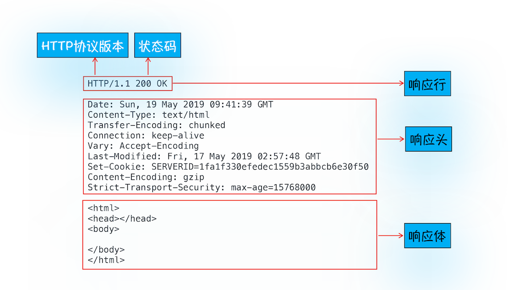

# 宏观视角下的浏览器

## Chrome 架构

查看 Chrome 进程情况： Chrome 又上角选项 -> 更多工具 -> 任务管理器。

并行处理：同一时刻处理多个任务。举例:

```
A = 1+1
B = 2*3
C = A*B
```

单线程从上到下计算，多线程同时计算 A、B，最后计算 C，性能提高了。

线程：不能单独存在，由进程来启动和管理。
进程：一个进程就是一个程序的运行实例，启动程序时，操作系统会为程序分配内存，用来存放代码、运行时数据和一个执行任务的主线程，这样的一个运行环境叫做进程。

线程依附于进程，而进程中使用多线程能并行处理提升运算效率。

关系：

1. 进程中任意线程出错，都会导致整个进程崩溃。如 B 计算 1/0 出错。
2. 线程之间共享进程的数据。
3. 进程关闭后，操作系统回收所占用的内存。
4. 进程之间的内容相互隔离。一个进程崩溃，不会影响其它进程。进程通信需要 IPC 机制。

单进程浏览器：网络、插件、js 运行环境、渲染引擎和页面都在一个进程。问题：

1. 不稳定
2. 不流畅
3. 不安全：运行插件可以获取操作系统的任意资源。恶意插件可以释放病毒，盗取密码。页面脚本也可以通过浏览器漏洞获取系统权限。

多进程浏览器


解决不稳定：多进程
不流畅：js 运行在渲染进程中，即使阻塞进程，也只影响当前渲染页面，而不会影响浏览器和其它页面。
安全问题：安全沙箱，即沙箱里的程序可以运行，单不能在硬盘上写入数据，也不能读取敏感位置的数据。插件进程和渲染进程在沙箱中。

目前多进程架构


-   浏览器进程： 负责界面显示、用户交互、子进程管理、提供存储等功能。
-   渲染进程：将 html/css/js 转为用户可交互的网页，排版引擎 Blick 和 js 引擎 v8 都在该进程中，默认 Chrome 会给每个同站点页面共享一个渲染进程(process-per-site-instance，[查看更多](http://www.chromium.org/developers/design-documents/process-models))。运行在沙箱模式下。
-   GPU 进程: 初衷是为了实现 3D CSS，后来网页、Chrome UI 界面都采用 GPU 来绘制。
-   网络进程
-   插件进程

多进程模型的问题：

-   更高的资源占用。每个进程都包含公共基础结构的副本(如 js 运行环境)。
-   更复杂的体系架构：浏览器各模块之间耦合性高，扩展性差。

面向未来服务的架构

2016 年,Chrome 提出了 **面向服务的架构**(Services Oriented Architecture，简称 SOA)。将原来各种模块重构为独立的服务，每个服务都可以在独立的进程中运行，访问服务必须使用定义好的接口，通过 IPC 通信，从而构建一个更内聚、松耦合、易于维护和扩展的系统。


同时，如果资源受限制的设备上，Chrome 会整合服务到一个进程中，节省内存。


-   [v8 官网](https://v8.dev/)
-   [chrome 设计文档](http://www.chromium.org/developers)

## TCP 协议

FP(first paint): 从页面加载到首次开始绘制的时长。这个指标直接影响用户跳出率。

大数据拆成小数据包来传输。数据包从 A 到 B 传输过程：

1. ip: 数据包要在互联网传输，就要符合网际协议(internet protocol, ip)标准。
2. 数据包交给网络层，网络层给数据包附加 ip 头， 包括 ip 版本， 源 ip ，目标 ip，生存时间。
3. 通过物理网络传输给 B。
4. B 网络层拆开数据包 ip 头，将数据交给应用层。

ip 将数据包发给指定的电脑。
UDP（user datagram protocol) 用户数据包协议，通过端口号将数据给指定程序。

UDP 可以校验数据是否正确，但是对错误的包，不提供重发机制，不知道数据是否到达 B，也不能重组包。传输速度快，适合在线视频，互动游戏。
但是有些数据需要安全的到达，所以有了 TCP。
TCP: transmission control protocol，传输控制协议，面向连接、可靠的、基于字节流的传输层协议。
特点：

-   对于数据包丢失，重传机制
-   数据包排序机制，将乱序数据包重组为完整的包

完整的 TCP 生命周期：

-   连接三次握手 时序图
-   传输数据
-   断开：四次挥手

## HTTP 请求流程

浏览器发起 http 请求过程：

1. 构建请求： 构建请求头信息

```
GET /index.html HTTP1.1
```

2. 查找缓存：有缓存则直接返回该资源的副本，并直接结束请求。好处：减少服务器压力，提升资源加载速度。
3. 缓存查找失败，开始网络请求。
4. 为数据传输准备 ip 和端口。
    - DNS (domain name system)将 url 映射成 ip。
    - 有 DNS 数据缓存服务
    - 得到 ip
    - 根据 url 得到端口号，默认 80
5. 等待 TCP 队列，chrome 默认同一个域名最多 6 个 TCP 连接。如果小于 6 则建立 TCP 连接。
6. 建立 TCP 连接。
7. TCP 传输数据，即发送 HTTP 请求，包括请求方法、url，http 版本、请求头、请求体(post)。http 请求报文格式：


8. 服务器处理 HTTP 请求，返回响应，包括协议版本、状态码、服务器信息等。



9. 断开连接：一旦服务器返回请求数据，就要关闭 TCP 连接，不过可以在头信息中加入 `Connection: Keep-Alive` 保持连接复用 TCP，这样可以省去下次连接的开销。
10. 重定向，如果状态码是 301 ，就是告诉浏览器要重定向，浏览器获取响应头的 Location，重新导航这个地址。

为什么很多站点第二次打开速度会很快？

因为有缓存: DNS 缓存，页面缓存。

缓存查找过程：
服务器返回 http 响应给浏览器，浏览器通过响应头 Cache-Control 设置是否缓存资源，时长通过 Cache-Control 里的 Max-age 设置。

```
Cache-Control: Max-age=2000
```

如果缓存资源未过期，则直接返回，如果过期了，则发起网络请求，并在 HTTP 请求头带上

```
If-None-Match:"4f80f-13c-3a1xb12a"
```

服务器收到后，会根据 If-None-Match 值判断请求的资源是否有更新。
没更新就返回 304，表示该缓存可以继续用。
有更新就返回资源给浏览器。

登录状态如何保持？

用户 post 账户密码
服务器返回头 `Set-Cookie: UID=3431uad;`给浏览器。
浏览器会保存到本地，再次访问时，会将`Cookie: UID=3431uad;`发送给服务器。
服务器根据 Cookie 判断用户是否登录。

disk：新 tab 打开时，都是 disk；html 文件都是 disk
memory：新 tab 再次使用缓存时，是 memory

完整的示意图


http 请求的 8 个阶段: 构建请求、查找缓存、准备 IP 和端口、发起 TCP 连接、发送 HTTP 请求、服务器处理请求、服务器返回请求和端口连接。

如果一个页面的网络加载时间过久，你是如何分析卡在哪个阶段的?
https://developers.google.com/web/tools/chrome-devtools/network/reference#timing-explanation 举个例子 Content Download 如果太长，很有可能是下载的资源太大，但也有可能是网络慢导致的下载太慢，简单计算一下，在例如 Waiting (TTFB) 这个太长的话，有可能是网络慢，或者就是 后端处理时间过长导致的，至少可以排查掉前端原因，还有很多，例如 DNS lookup 等，但是最终要确认具体哪里慢，最好是结合系统日志去分析

## 导航流程

从输入 URL 到页面展示，这中间发生了什么？


-   浏览器进程收到用户输入的 URL 请求，将该 URL 转发给网络进程。
-   网络进程发起 URL 请求。
-   网络进程收到响应头数据，解析并将数据转发给浏览器进程。
-   浏览器进程收到网络进程的响应头数据后，发送`提交导航`(CommitNavigation)消息(会携带响应头等基本信息)到渲染进程。
-   渲染进程收到消息后，开始准备接收 HTML 数据，接收方式是直接和网络进程建立数据管道。
-   渲染进程向浏览器进程`确认提交`，告诉浏览器已经准备好接收和解析数据。
-   浏览器进程收到渲染进程`提交文档`的消息后，移除之前旧文档，更新浏览器进程中的页面状态。

其中，用户发起 url 请求到页面开始解析的过程，叫做导航。

1. 用户输入
    - 输入搜索内容: 和浏览器默认搜索引擎合成 URL。
    - 输入请求 URL: 加协议等，合成完整的 URL。
2. 回车
    - 清理旧页面， beforeunload 事件可以做数据清理或询问用户是否要离开。
    - 标签页图标变成加载状态，页面还是之前的页面，需要等提交文档阶段，页面内容才会替换。
3. URL 请求过程

    - 浏览器进程通过 IPC 把 URL 发给网络进程
    - 网络进程查找缓存，有则直接返回，没有则网络请求(DNS 解析，如果是 HTTPS 还要建立 TLS)
    - 利用 IP 和服务器建立 TCP 连接，浏览器端构建请求行、请求头等信息，发给服务器
    - 服务器收到后，生成响应数据，发给网络进程，网络进程收到响应行和响应头开始解析

        - 处理状态码
            - 重定向： 301 或 302，读 Location，重新导航请求
            - 200 浏览器继续处理请求
        - 处理响应类型
            - Content-Type: 响应体数据是什么类型
                - `application/octet-stream`: 字节流，按下载类型处理，同时该 url 请求导航流程结束
                - `text/html`: 继续导航
        - 准备渲染进程：

            - 每个标签对应一个渲染进程（左键点击才算，右键新开会新开渲染进程)
            - 同一站点(same-site)： 根域名、协议相同。新页面会复用父页面的渲染进程,process-per-site-instance。
            - 使用 noopener noreferrer 就是告诉浏览器，新打开的子窗口不需要访问父窗口的任何内容，这是为了防止一些钓鱼网站窃取父窗口的信息。会新开渲染进程

        - 提交文档，浏览器进程将网络进程数据交给渲染进程
            - 浏览器进程收到网络进程的响应头数据后，向渲染进程发起`提交文档`的消息。
            - 渲染进程收到消息，会和网络进程建立传输数据的管道。
            - 数据传输完成，渲染进程返回`确认提交`消息给浏览器进程。
            - 浏览器进程收到消息，更新浏览器界面状态，包括安全状态、地址栏 URL、前进后退的历史状态，并更新 web 页面。
        - 渲染阶段：渲染进程开始页面解析和子资源加载

## 渲染流程

-   [深入了解现代 Web 浏览器（第 1 部分）](https://developers.google.com/web/updates/2018/09/inside-browser-part1)

openId omvMN5KyrfvTDD0iQGbhY8M_sZmg
userInfo {"nickName":"板栗","gender":1,"language":"zh_CN","city":"Qianjiang","province":"Hubei","country":"China","avatarUrl":"https://wx.qlogo.cn/mmopen/vi_32/DYAIOgq83epCVsZFRYQ0yGjw5HMorkBJFbub7RwatYdSYS6W0MWsmACPfSrZlUVfic6ibBRtNbG5Gd3IsAZk7F9Q/132"}
