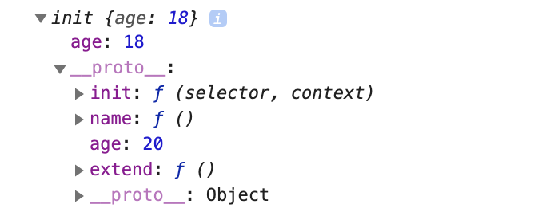

# jQuery 整体架构

## 整体架构简析

jQuery 的整体架构如下：

```js
(function(window) {
    var jQuery = function(selector, context) {
        // 返回一个对象
        return new jQuery.fn.init(selector, context);
    };

    jQuery.prototype = jQuery.fn = {
        init: function(selector, context) {
            this.age = 18;
            return this;
        },
        name: function() {
            console.log("name");
        },
        age: 20
    };

    // 扩展方法
    jQuery.extend = jQuery.fn.extend = function() {
        console.log(this);
    };

    jQuery.fn.init.prototype = jQuery.fn; // 关键，将jQuery 对象的原型设置为 jQuery.fn

    // 浏览器环境下，将 jQuery 挂载到 window 上
    if (typeof window === "object" && typeof window.document === "object") {
        window.jQuery = window.$ = jQuery;
    }
})(window);
```

上面代码分析：

1. 整体代码放在匿名函数中一开始就自执行。

2. 如果是浏览器环境，则将 `jQuery` 和 `$` 挂载到全局 window 上。

```js
if (typeof window === "object" && typeof window.document === "object") {
    window.jQuery = window.$ = jQuery;
}
```

3. 通过 `new jQuery.fn.init()` 创建 jQuery 对象，然后通过 `jQuery.fn.init.prototype = jQuery.fn` 将 jQuery 对象的原型设置为`jQuery.fn`，这样 jQuery 对象上就拥有了`jQuery.fn`上的所有方法。如下为打印的 `$()` 对象。



4. 如果要扩展 jQuery 和 jQuery.fn 对象，是通过 extend 方法，虽然它们两个的 extend 方法是同一个，但是可以通过 this 对象来区分。如下:

```js
$.extend = function() {
    console.log(this); // this 是 $
};
$.fn.extend = function() {
    console.log(this); // this 是 $.fn
};
```
