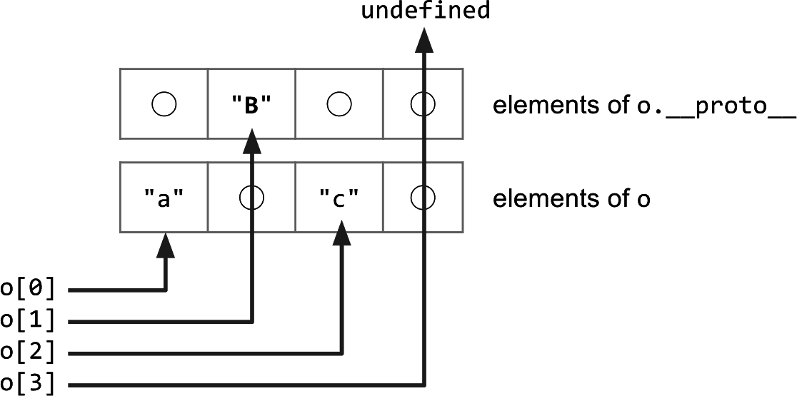

# 图解 v8 笔记

## 函数即对象

- 什么是基于对象？
- 传统面向对象语言里的对象特点
  - 继承： public interface 等很多关键字
  - 多态
- js 中对象特点： 就是属性和值的集合
  - 运行时可以修改对象内容
  - 继承: 原型链继承，对象上加属性指向原型
  - 无多态(貌似有 new )

对象属性值：

- 原始类型(primitive): 值是不可变的，修改时，会新建一个替换。
  - null
  - undefined
  - boolean
  - number
  - string
  - bigint
  - symbol
- 对象类型: object
  - object/array/map/set/weakmap/weakset
- 函数类型 function
  - 本质是一种特殊的对象：可以拥有属性，区别是可以被调用
  - v8 内部给函数添加了 2 个隐藏属性保存在内存，函数指向时，会取出 code 执行。
    - name: 匿名则为 anonymous
    - code
  - 针对参数：函数内部变量有个作用域链(执行上下文)
    - 闭包：将外部变量和函数绑定起来的技术叫闭包

## 快属性和满属性：v8 提升对象属性访问速度

v8 里对象并没有完全用字典来存储。因为线性数据结构查询效率更高，v8 为了提升存储和查询效率考虑，采用了一种复杂的存储策略。

- 排序属性(v8 element): 数字属性，给对象添加的数字属性会被排序。
- 常规属性(v8 properties)：字符串属性。

ECMAScript 规范中定义了数字属性应该按照索引值大小升序排列，字符串属性根据创建时的顺序升序排列。

```js
function Foo() {
  this[100] = "test-100";
  this[1] = "test-1";
  this["B"] = "bar-B";
  this[3] = "test-3";  // 注意对象的 key 打印都是字符串
  this["2"] = "test-2"; // 注意 如果字符串能转为数字，则会变成数字属性。
  this["A"] = "bar-A";
}
var bar = new Foo();
for (key in bar) {
  console.log(`index:${key}  value:${bar[key]}`);
}
// 依次是 1 3 100 B A
```

所以上面的 bar 对象会包含 2 个隐藏属性，类似如下：

```js
bar = {
    hiddenClass: {
        'bit field 1',
        'bit field 2',
        'bit field 3': {
           '属性个数',
            '指针：指向描述符数组'
        },
        // ...
        'Descriptor Array': '包含命名属性的名称和值的存储位置'
    },
    elements: {
        1: 'test-1',
        100: 'test-100',
        2: 'test-2',
        3: 'test-3',
    },
    // 最新的 chrome 直接 <10，没有 properies 属性了
    properties: {
        'B': 'bar-B',
        'A': 'bar-A'
    },
    __proto__: '原型',
    map: '隐藏类',
    // 10 个properties属性
    'A': 'bar-A',
    'B': 'bar-B',
    // 10 个 elements 属性
    [1]: 'test-1',
    [100]: 'test-100',
    [2]: 'test-2',
    [3]: 'test-3',
}
```

- 当遍历时，v8 会先从 elements 遍历，然后再遍历 properties。
- 当 bar.B 时，v8 一看是字符 B，会找 properties(这里多了一步，影响性能)，再找 .B 属性。

**对象内属性和普通属性**

- 对象内属性：v8 中最快的属性，直接存储在对象本身上，对象内属性的数量由对象的初始大小决定。如果属性多于对象空间，则会将它们存在普通属性 properties 中。
- 普通属性

**快慢属性**

- 快属性: 线性存储中的属性，元信息存在 HiddenClass 中，通过索引可以快速访问(为了从属性名获取值的实际位置，需要查询 HiddenClass 中的描述符数组)，但是增加、删除效率低。
- 慢属性：属性过多时或者存在反复添加或者删除属性的操作，采用这种策略提升修改速度。属性信息保存在非线性数据结构中，可以高效删除和添加属性，但访问要慢。如果一个对象添加和删除很多属性，就会消耗大量时间来更新维护 HiddenClass，所以具有较慢属性的对象具有独立的字典来存储 key 和 value,而不存在 HiddenClass 中。

索引属性主要是作用于数组的。

**hiddenClass**

- hiddenClass 用来描述对象形状，对优化编译器和内联缓存很重要
- 添加数组索引属性不会创建新的 HiddenClasses。
- hiddenClass 是动态创建的，并随着对象的变化而更新。
- 有一颗 HiddenClasses 树，保存了对象每一步(新增属性)所创建的 hiddenClass，如果对象相同(属性顺序相同，值可以不同)，则会重复利用。一旦修改，则会单独创建一个分支。


比如新增了 d 属性，会新建分支。


**elements 或数组**

- 数组有孔时(中间缺元素，为 undefined)，它会去原型上查找（慢），所以最好用特殊值标记。
- elements 可能是数组，也可能是字典
- 数组方法对慢属性执行也慢一些
- Smi（小整数）和 Double Elements



```js
const o = ['a', 'b', 'c'];
console.log(o[1]);          // Prints 'b'.

delete o[1];                // 删除元素，elements上加了个孔
console.log(o[1]);          // Prints 'undefined';
o.__proto__ = {1: 'B', 3: 'X'};     // Define property 1 on the prototype.

console.log(o[0]);          // Prints 'a'.
console.log(o[1]);          // 去原型上查找，慢
console.log(o[2]);          // Prints 'c'.
console.log(o[3]);          // Prints X，也会查找原型

// 转换为稀疏数组，map
const sparseArray = [];
sparseArray[9999] = 'foo';  // 会创建字典 elements

// 无法在HiddenClass上存储描述信息，下面也是慢属性
const array = [];
Object.defineProperty(array, 0, {value: 'fixed' configurable: false});
console.log(array[0]);      // Prints 'fixed'.
array[0] = 'other value';   // Cannot override index 0.
console.log(array[0]);      // Still prints 'fixed'.

const a1 = [1,   2, 3];  // 会被转为小整数
const a2 = [1,    , 3];  // Smi Holey, a2[1] reads from the prototype
const b1 = [1.1, 2, 3];  // V8为纯双精度数组存储原始双精度值，以避免内存和性能开销
const b2 = [1.1,  , 3];  // Double Holey, b2[1] reads from the prototype
```

- [V8 中的快速属性](https://v8.dev/blog/fast-properties)

不建议 delete 来删除属性?

- 删除索引属性，会造成孔
- 删除命名属性，会重新生成 hiddenClass
