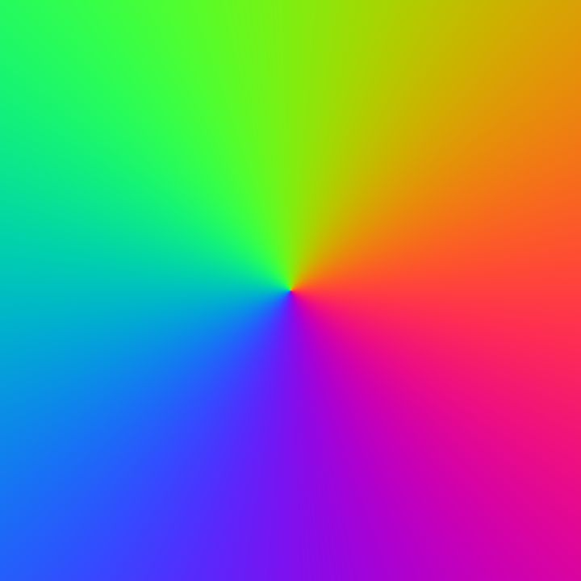

# canvas

```javascript
var canvas = document.getElementById('canvas')
var context = canvas.getContext('2d')  // 获取渲染上下文
```

canvas的坐标是以左上角为(0,0)，x,y轴方向分别是右下。

## 绘制

canvas是基于状态绘制的，首先描述状态，然后再进行绘制。

**绘制矩形**

```javascript
// 描述状态路径
context.rect(x, y, width, height)

// 直接绘制
context.fillRect(x, y, width，height)  // 实心
context.strokeRect(x, y, width, height)  // 空心
```

**绘制路径**

```javascript
context.beginPath()     // 开始设置路径
context.moveTo(10, 20)  // 设置起点
context.lineTo(50, 20)  // 设置终点
context.stroke()        // 绘制路径

context.fill()  // 填充路径，当调用fill()函数时，所有没有闭合的形状都会自动闭合，所以你不需要调用 closePath() 函数。
context.closePath()  // 可以自动闭合路径
```

**绘制圆弧**

```javascript
context.arc(x, y, radius, startAngle, endAngle, anticlockwise)
```
- startAngle：默认是0，方向向右
- anticlockwise：可选，默认是false，表示顺时针绘制
- startAngle,endAngle：是弧度，不是角度，需要将角度转成弧度。
     - degree *(Math.PI / 180)

**绘制文本**

```
context.fillText(text, x, y)
context.strokeText(text, x, y)
```

x,y 表示文本左下角的坐标。

**设置颜色**

```
context.fillStyle = color
context.strokeStyle = color
```

**修改线宽**

```
context.lineWidth = number
```

**擦除canvas**

```
context.clearRect(x, y, width, height)
```

**加载图像**

```
context.drawImage(image对象, x, y, [width], [height])
```

如果没有设置宽、高，则会显示原始尺寸

**图像裁剪**

```
context.drawImage(image, source_x, source_y, source_width, source_height, x, y, width, heigh);
```

`source_x, source_y` 表示以图片的哪个点为起点。 `source_width, source_height` 是图片裁剪大小。 x,y是要在画布的哪个点开始画，width，height是画多大。


**碰撞检测**

1. 如果是2个方形元素

```
if(!(b1.x + b1.width < b2.x) || (b2.x + b2.width < b1.x) || (b1.y + b1.height < b2.y) || (b2.y + b2.height < b1.y) ){
    // ...
}
```

2. 如果是圆形

通过连接圆心的三角形来判断， 圆心距离的平方小于两个圆心点水平垂直距离平方的和。

```
var dx = circle2.x - circle1.x;
var dy = circle2.y - circle1.y;
var distance = Math.sqrt((dx * dx) + (dy * dy));
if (distance < circle1.radius + circle2.radius) {
  // 两个圆形碰撞了
}
```

**save()和restore()**

ctx.save() 可以用来保存当前context上下文的状态，注意不是保存图像， ctx.restore()用来取出context状态。具体查看[Canvas学习：save()和restore()](https://www.w3cplus.com/canvas/canvas-states.html)


***创建渐变**

- ctx.createLineGradient(x0,y0,x1,y1)
- ctx.createRadialGradient(x0,y0,r0, x1,y1,r1)

添加颜色，需要使用addColorStop(position, color) 方法。

```
var gradient = ctx.createLinearGradient(0, 0, 0, h); gradient.addColorStop(0, 'rgb(255,0,0)'); //红 gradient.addColorStop(0.5, 'rgb(0,255,0)');//绿 gradient.addColorStop(1, 'rgb(0,0,255)'); //蓝 ctx.fillStyle = gradient; ctx.fillRect(0, 0, w, h);
```

渐变是以两个圆形成的圆锥为渐变。具体查看[Canvas学习：渐变](https://www.w3cplus.com/canvas/gradient.html)。


## getImageData()、putImageData()、createImageData()

`getImageData(x,y,width,height)` 用于复制画布上指定图形的像素数据，`putImageData(imgData, x, y)` 用于将图形数据放回画布。

```
var c=document.getElementById("myCanvas");
var ctx=c.getContext("2d");
ctx.fillStyle="red";
ctx.fillRect(10,10,50,50);

function copy() {
    var imgData=ctx.getImageData(10,10,50,50);
    ctx.putImageData(imgData,10,70);
}
```

`imgData`对象的data属性存每四位存放着每个像素的rgba值(alpha通道0 是透明的，255 是完全可见的)。所以遍历每一个像素可以通过下面的方法。

```
// 反转颜色
for (var i=0;i<imgData.data.length;i+=4) {
  imgData.data[i]=255-imgData.data[i];
  imgData.data[i+1]=255-imgData.data[i+1];
  imgData.data[i+2]=255-imgData.data[i+2];
  imgData.data[i+3]=255;
  }
```
createImageData() 用于创建imgData对象。

```
// 创建 100*100 像素的 ImageData 对象，其中每个像素都是红色的，然后把它放到画布上
var c=document.getElementById("myCanvas");
var ctx=c.getContext("2d");
var imgData=ctx.createImageData(100,100);
for (var i=0;i<imgData.data.length;i+=4)
  {
  imgData.data[i+0]=255;
  imgData.data[i+1]=0;
  imgData.data[i+2]=0;
  imgData.data[i+3]=255;
  }
ctx.putImageData(imgData,10,10);
```

## 变形

- translate(x, y)
- scale(x, y)
- rotate(deg)  默认是以canvas左上角为圆点进行旋转。如果要以自身中心旋转，需要首先移动圆点translate(图形中心点x,图形中心点y)，然后绘制图形，注意绘制时图形是以此时的圆点是图形的中心点。
- transform()

```
ctx.fillStyle = 'red'
//    ctx.scale(5,5)
ctx.translate(115, 115);
ctx.rotate(30 * Math.PI/180)
ctx.fillRect(-25, -25, 50, 50)
```

## 图像合成

- globalAlpha：可以设置为0或1
- globalCompositeOperation： 设置合成模式

具体参考：[Canvas学习：图像合成](https://www.w3cplus.com/canvas/compositing.html)

## 阴影

可以设置shadowOffsetX、shadowOffsetY、shadowBlur、shadowColor（默认是全透明的黑色）。分别表示右阴影，下阴影，模糊度，颜色。

## 参考文章

- [Html5 Canvas 学习笔记](https://www.gitbook.com/book/oxcow/h5-canvas-study-notes/details)


https://www.createjs.com/easeljs


## drawImage()

```
context.drawImage(image|canvas, dx, dy, dw, dh)

// 渲染图像的一部分，s表示源图像的位置和区域
context.drawImage(image|canvas, sx, sy, sw, sh, dx, dy, dw, dh)
```

### 滑杆缩放

事件：onmousemove 或使用 [oninput 和 onchange](https://stackoverflow.com/questions/18544890/onchange-event-on-input-type-range-is-not-triggering-in-firefox-while-dragging)

### 拖拽

## 离屏Canvas

将第二个 canvas 的内容加载到第一个 canvas 上。第二个 canvas 设置为`display:none`

**添加水印**

- 直接在 canvas 上绘制水印
- 如果经常变，可以用离屏canvas

```javascript
// 水印canvas

```

**与鼠标交互**

## 获取图像像素

```javascript
imageData = context.getImageData(x, y, w, h)
```

imageData对象：
- width
- height
- data

**putImageData()**

通常是获取数据后，进行修改，再putImageData。

```javascript
context.putImageData(imageData, dx, dy, dirtyX, dirtyY, dirtyW, dirtyH)
```

dirtyX, dirtyY 会加到 dx，dy 上

**imageData.data的存储**

它是将 canvas 上的像素转成了一个数组，每四项(0 - 255)分别存储了一个像素的 rgba 值。

所以第 i 个像素：

- r: `4i + 0`
- g: `4i + 1`
- b: `4i + 2`
- a: `4i + 3`

第 x 行 y 列的像素是第`x * width + y`个元素。

灰度滤镜公式：

```
灰度值 = r * 0.3 + g * 0.59 + b * 0.11
```

- 黑白滤镜公式：灰度值大于 255/2 就设置为 255，小于则设置为 0。
- 反色滤镜：255 - r|g|b
- 模糊滤镜：获取点周围的8个点（模糊半径）的 rgb 值，然后计算平均值。
- 马赛克滤镜：将某个范围(如 4px * 4px)的 rgb 都设置为平均值。

**createImageData()**

```javascript
var imageData = createImageData(width, height)
```

[生成拾色器的算法](https://www.zhihu.com/question/30262900)



```
```
