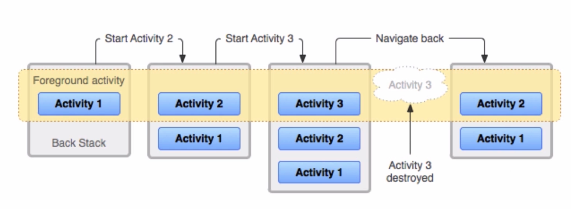
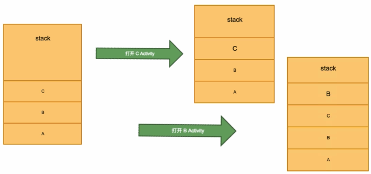
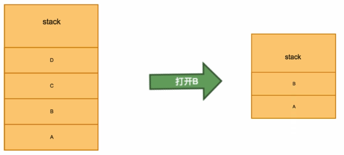
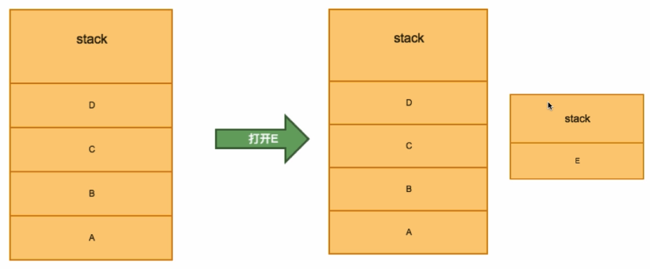

## Android

### Activity

Android 里 每个页面就是 Activity。Activity 是由 Layout 、数据以及一些交互组成的。

### 创建 Activity

1. 新建一个 `TestActivity.java` 文件和 `activity_test.xml` 布局文件。

```java
package com.banli17.test;

import androidx.appcompat.app.AppCompatActivity;

// 这里需要继承 AppCompatActivity
public class TestActivity extends AppCompatActivity{

}
```

2. 在 `AndroidManifest.xml` 里添加 `activity` 配置，相当于路由。

```xml
<application
    ...
    <activity android:name=".TestActivity">
    </activity>
</application>
```

3. 回到 `TestActivity.java` 中，关联 `Activity` 和 `Layout`。

```java
public class TestActivity extends AppCompatActivity{
    // 关联
    setContentView(R.layout.activity_test)
}
```

### 查找视图

```
// 通过 id 查找
findViewById(R.id.titleTextView)
```

通过在`values/strings.xml`统一管理 string。

### 启动模式和跳转

Activity 的 4 种启动模式:

1. standard：标准的启动模式，Activity 是通过栈来管理的。



2. singleTop: 顶部复用，最顶部的 Activity 只会打开一个。



3. singleTask: 如果栈里已经有了这个 Activity，会将它顶部的清除掉。



4. singleInstance: 单例，会重新启动一个栈。比如打电话界面，如果不用单例，返回就返回主界面了。



可以在 `AndroidManifest.xml` 针对 activity 来设置专门的模式。

```xml title="AndroidManifest.xml"
<activity android:name=".TestActivity" android:launchMode="singleTask"/>
```

也可以在 Java 代码中设置：

```java title="跳转到其它页面"
Intent intent = new Intent(MainActivity.this, TestActivity.class);
intent.addFlags(Intent.FLAG_ACTIVITY_NEW_TASK);  // 设置新栈打开
startActivity(intent);
```

### 生命周期

- `onCreate()`
- `onStart()`
- `onResume()`: 可以交互了
- `onPause()`
- `onStop()`
- `onDestroy()`
- `onRestart()`


### Activity 间数据传递

### 路由传参

可以传递多种类型的参数，如下。

1. 传递基础类型参数。

```java title="传递基础类型"
final String BUTTON_TITLE = 'BUTTON_TITLE';

Intent intent = new Intent(MainActivity.this, TestActivity.class);
intent.putExtra(BUTTON_TITLE, getString(R.string.app_name))
startActivity(intent);

// 获取参数
if(getIntent() != null){
    String title = getIntent().getStringExtra(MainActivity.BUTTON_TITLE)
}
```

2. 传一个 Bundle，相当于 hashMap。

```java title="传Bundle"
Bundle bundle = new Bundle();
bundle.putString(BUTTON_TITLE, getString(R.string.app_name));
bundle.putExtra('hashMap', bundle);

// 获取参数
Bundle bundle = getIntent().getBundleExtra(MainActivity.BUTTON_TITLE);
if(bundle != null){
    String buttonTitle = bundle.getString(MainActivity.BUTTON_TITLE);
}
```

3. 传递序列化对象 Parcelable(性能高，麻烦些)、Serializable(性能低些，简单)。

```java title="传递序列化对象"
public class Person implements Serializable{
    public String name;
    Person(String pname){
        name = pname
    }

    // 里面的对象也都需要序列化
    public class BasicInfo implements Serializable{

    }
}
Person person = new Person("李四");
intent.putExtra("person", person);

// 获取参数
Person s = (Person) getIntent().getSerializableExtra("person");
if (s != null) {
    Log.d(TAG, "onCreate: " + s.getName());
}
```

### 关闭页面时回传参数

1. 使用 `setActivityForResult` 方法打开新页面，并在生命周期方法 `onActivityResult` 里进行监听。

```java
// 打开页面2
void goToPage2(){
    ...
    final int REQUEST_CODE = 200;
    setActivityForResult(intent, REQUEST_CODE);
}

@Override
protected void onActivityResult(int requestCode, int resultCode, @Nullable Intent data) {
    super.onActivityResult(requestCode, resultCode, data);

    if (requestCode == REQUEST_CODE && resultCode == 900) {
        String title = data.getStringExtra("title");
        setTitle(title);
    }
}
```

2. 在 page2 页面回传数据。

```java
@Override
public void finish() {
    final int RESULT_CODE = 900;
    Intent intent = new Intent();
    intent.putExtra("title", "前一个页面回来了");
    setResult(RESULT_CODE, intent);

    super.finish();
}
```

### 参考资料

- [Android 开发者官网 Activity](https://developer.android.com/guide/components/activities/activity-lifecycle)
- [慕课网 Android 工程师](https://class.imooc.com/sale/newandroid)
