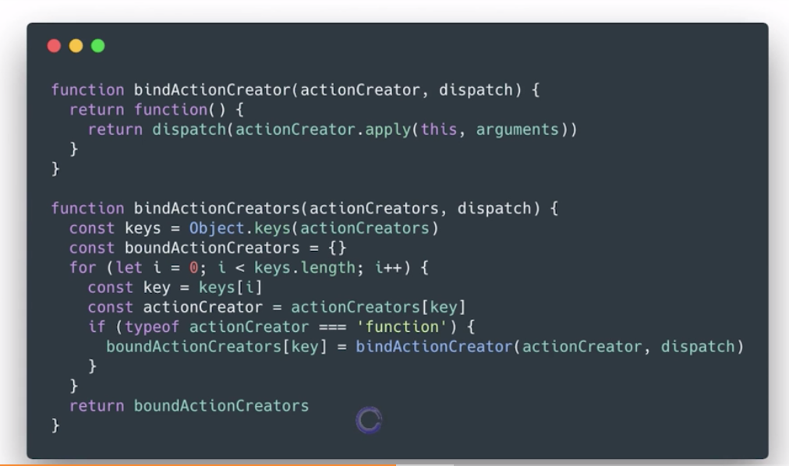
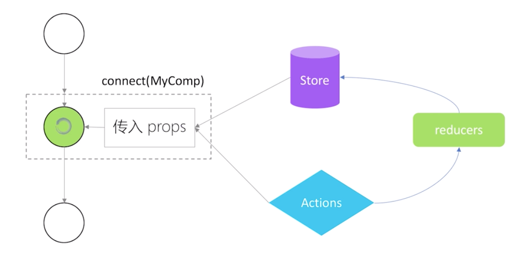
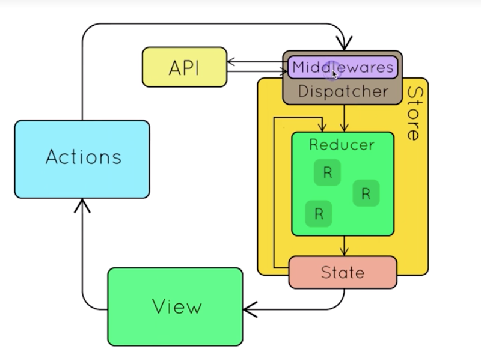

# redux

传统

-   一个 view 可能使用多个 model
-   一个 model 可能被多个 view 使用

redux

-   单向数据流
-   单一的 store，所有 view 使用单一 store
-   可预测， state + action => new state
-   纯函数更新 store

## 三个核心概念

-   store
    -   getState()
    -   dispatch(action)
    -   subscribe(listener)
-   action
-   reducer

### store

store 包含三个部分： state、reducer、dispatch

创建 store 的方法

```
const store = createStore(reducer)
```

### action

```
{
    type: ADD_TODO,
    text: ''
}
```

### reducer

reducer 是一个纯函数，返回一个新的 state。所有的 reducer 会接受到所有的 action，根据 action.type 来判断是否执行。

```js
function todoApp(state = initialState, action) {
    switch (action.type) {
        case ADD_TODO:
            return state;
        default:
            return state;
    }
}
```

点击 ui 时，产生一个 action，经过 store 时，dispatch 这个 action，reducer 对它进行处理，返回新的 state，然后视图变化。

### combineReducer

如果有多个 reducer，需要用 combineReducer，返回一个封装后的 reducer。

### bindActionCreators

dispatch(action) 结构是一致的，可以将它封装起来。

```
const boundAddTodo = text => dispatch(addTodo(text))
```

所以 redux 提供了工具函数 bindActionCreators()。



## 在 react 中使用 redux

```js
import {connect} from react-redux
class A extens Components{}
// 把数据传进来给组件使用
function mapStateToProps(state){
    return {
        a: state.a   // 只有 a 更新时，组件才更新，不要传递 state，任何更新都会更新
    }
}
// 把 action 传递进来更新组件
function mapDispatchToProps(dispatch){
    return bindActionCreators({ plusOne, minusOne }, dispatch)
}
export default connect(mapStateToProps, mapDispatchToProps)(A)
```

connect 工作原理：高阶组件



state 变化后传给高阶组件属性，高阶组件再控制更新。

```
<Provider store={store}>
    <ConnectedCounter />
</Provider>
```

异步 action



Middleware: 截获 action 后，再 dispatch。

返回一个 promise 请求完成完后，resolve 时再 dispatch

### 如何组织 Redux Action

1. 所有的 Action 放在一个文件，太多太混乱。
2. Action，Reducer 分开，实现业务逻辑需要来回切换。
3. 系统中有哪些 Action 不够直观。

新的方式：单个 action 和 reducer 放在同一个文件。

-   易于开发，不用 action 和 reducer 文件来回切换。
-   易于维护，每个 action 都很小，容易理解。
-   易于测试，每个业务逻辑只需要对应一个测试文件。
-   易于理解，文件名就是 action 名字，文件列表就是 action 列表。

```
// type 定义在一起，防止冲突
import {
    COUNTER_PLUS_ONE
} from './constants'
// action 和 reducer 定义在一个文件，方便维护
export function counterPlusOne(){
    return {
        type: COUNTER_PLUS_ONE
    }
}
export function reducer(state, action){
    switch(action.type){
        case COUNTER_PLUS_ONE:
            return {
                ...state,
                count: state.count + 1
            }
        default:
            return state;
    }
}
```

每个 reducer 的 state 有命名空间是 reducer 的名字，所以可以重复。action.type 是不能重复的。

```
{
    todos:{
        show: true
    },
    lists:{
        show: true
    }
}
```

### 不可变数据(immutable data)

不可以直接修改值，而是要复制后修改再返回。

为何需要不可变数据：

1. 性能优化。旧的 state 变化后，只需要比较引用，而不用去比较值。
2. 易于调试和跟踪。可以根据旧 state 和新 state，计算 diff。
3. 易于推测。 store 是由 action 引起的，可以看到之前和后来的 state。

如何操作不可变数据

1. 原生写法: {...}，Object.assign
2. 借助工具类 immutability-helper：层次比较深时可以用
3. immer: 性能差些，小型应用可以，会为每个属性增加一个代理

## react-router

为什么需要路由

-   单页应用需要页面切换
-   通过 URL 定位到页面
-   更有语义的组织资源

路由实现的基本架构

-   路由定义 /topic/:id -> Topic
-   Router
-   页面

和服务端路由的对比

-   声明式路由定义，标记一样
-   动态路由

三种路由的实现方式

-   hash
-   history
-   内存路由: url 不会变化，路由存在内存中。

```js
import { MemoryRouter } from "react-router";
```

基于路由配置进行资源组织

-   实现业务逻辑的松耦合
-   易于扩展、重构和维护
-   路由层面实现 Lazy Load

api

```
<Link to="/about">about</Link>

// 可以多一个 class，路径一致时可以高亮
<NavLink to="/about" activeClassName="selected">about</NavLink>

// 弹出提示
<Prompt when={formIsHalfFilledOut} message="are you sure out?">

// 重定向
<Route exact path="/" render={()=>{
    loggedIn ? <Redirect to="/dashboard">
        : <PublicHomePage>
}}>

// 如果匹配了，都会显示，没有排他性
// exact 是否精确匹配
<Router>
    <Route exact path="/" component={Home}>
    <Router path="/news" component={NewsFeed}>
</Router>

// 有排它性，只显示最先匹配的一个
<Switch>
    <Route path="/home" component={Home}>
    <Router path="/news" component={NewsFeed}>
</Switch>
```

通过 url 来传参

1. `<Route path="/topic/:id" component={Topic}/>`
2. 会传一个 match 参数`this.props.match.params`

```
const Topic = ({match}) => (<div>{match.params.id}</div>)

<Route path="/topic/:id" component={Topic}/>
```

选择 UI 库的考虑因素

1. 组件库是否齐全
2. 样式风格是否符合业务需求
3. API 设计是否便捷和灵活
4. 技术支持是否完善，issue
5. 开发是否活跃
