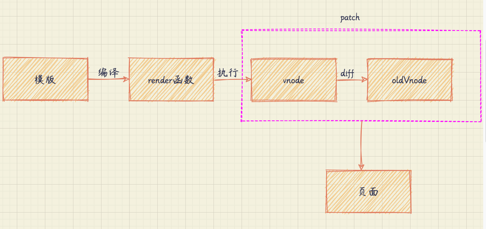

# 深入浅出 vue.js 笔记

## 学习资料

- 书籍 <<深入浅出 Vue.js >>，刘博文

## 5. 虚拟 DOM 简介

### 5.1 什么是虚拟 DOM

渲染： 状态 -> dom -> 显示在页面

状态变化时，dom 的更新：

- 暴力?，费性能
- 虚拟 DOM: 通过状态生成虚拟节点树(vnode 树)，使用虚拟节点树进行渲染，新生成的树与上一次的树进行比较，差异更新

### 5.2 为什么引入虚拟 DOM

angular 和 react 不知道哪些状态变化了，需要使用暴力对比，react 是虚拟 dom 的比对，angular 是脏检查。

vue 不一样，它知道具体哪些状态变化了，所以可以更细的更新。但是粒度太细，每个绑定都要一个 watcher 来观察变化，会增加内存开销，节点越多开销越大。所以 vue2 引入了虚拟 dom，组件级别是一个 watcher 实例。即组件内有 10 个节点使用了某个状态，但是只有一个 watcher 在监听变化，状态变化时，组件内部通过虚拟 dom 进行对比和渲染，这是一个折中方案。

### 5.3 Vue.js 中的虚拟 DOM

### 5.4 总结

虚拟 DOM 是状态映射为视图的一种解决方案，是通过状态生成虚拟节点，然后使用虚拟节点渲染视图。

之所以需要虚拟节点，是因为真实 DOM 会有一定程度的性能浪费。

## 第 6 章: VNode

### 6.1 什么是 Vnode

就是一个描述 DOM 节点的 js 对象。

### 6.2 Vnode 的作用

用于 patch,因为每次小改动都去完全修改 DOM 是性能浪费的。

### 6.3 Vnode 的类型

- 注释节点
- 文本节点
- 克隆节点
- 元素节点
- 组件节点
- 函数式组件

### 6.4 总结

VNode 就是一个 js 对象，用于每次在更新时将新生成的 vnode 和 缓存中的 oldVnode 进行对比，然后只对组件进行差异的 DOM 更新,从而提升性能。

## 第 7 章： patch

patch 就是打补丁(通过对比 vnode 和 oldVnode)去更新 DOM。原因是直接操作 DOM 比较费性能。

DOM 的操作主要有：

- 新增节点
- 删除节点
- 更新节点

patch 的过程是：

1. 当 oldVnode 不存在时，直接用 vnode 渲染视图
2. 当 oldVnode 和 vnode 完全不是一个节点时，新增 vnode 节点并插入，然后删除 oldVnode 节点
3. 当 oldVnode 和 vnode 是同一个节点时，通过对比来更新 DOM 节点

新增节点情况有 3 种：

- 元素节点， 条件是 tag 有值
- 注释节点，没有 tag，条件是`isComment=true`
- 文本节点

删除节点的情况是：

- 该节点在 vnode 中不存在，在 oldVnode 中存在

更新节点的算法：

- 比较未处理的头头、头尾、尾头、尾尾
- 同层比较

树的 diff 是 O(3)。
